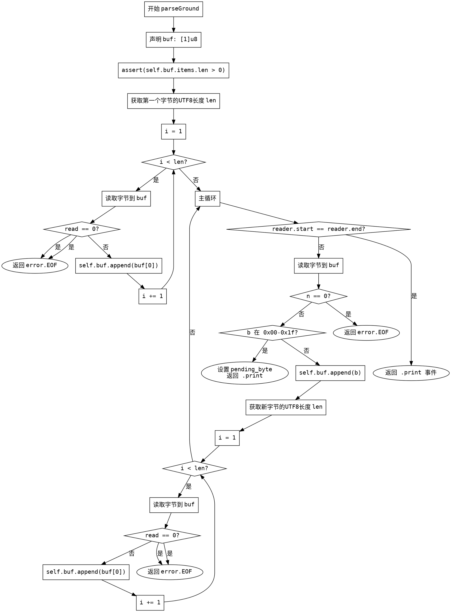

好的，我需要帮助用户根据提供的Zig代码生成一个Graphviz的流程图。首先，我得仔细阅读并理解这段代码的功能和结构。

这个函数是`parseGround`，它接受一个Parser指针和一个BufferedReader指针，返回一个Event类型的错误联合。看起来像是处理输入的字节流，生成事件，比如打印字符或者遇到控制字符时触发事件。

首先，函数开始时会声明一个长度为1的缓冲区buf。然后有一个块，其中使用assert确保self.buf.items的长度大于0。接着获取第一个字节的UTF-8序列长度len，然后从i=1循环到len，每次读取一个字节到buf，如果读取失败则返回EOF错误，否则将buf[0]追加到self.buf中。

接下来是一个无限循环，检查reader的start和end是否相等，如果是的话返回.print事件。然后读取一个字节到buf，如果n为0则返回EOF。然后根据字节b的值进行判断：如果是0x00到0x1f之间的控制字符，设置pending_byte并返回.print事件；否则，继续处理UTF-8序列的后续字节。

现在需要将这些逻辑转化为流程图。Graphviz的节点和边需要正确表示各个步骤和判断分支。

可能的步骤分解：

1. 开始函数。
2. 声明buf。
3. 断言self.buf非空。
4. 获取第一个字节的UTF8长度len。
5. 初始化i=1，循环读取后续字节，直到i < len。
6. 每个循环中读取一个字节，检查是否EOF，追加到self.buf。
7. 进入主循环，检查reader的start和end是否相等，是则返回.print。
8. 读取下一个字节，检查是否EOF。
9. 判断字节是否为控制字符：如果是，设置pending_byte并返回.print；否则，处理该字节的UTF8后续字节。
10. 处理后续字节的循环，类似步骤5-6。

需要注意循环结构，特别是内部的while循环。可能需要使用子图或条件节点来表示循环和分支。

可能的节点：

- 开始节点
- 声明buf
- 断言检查
- 获取len
- 初始化i=1
- 循环i < len
  - 读取字节
  - 检查read是否为0（EOF）
  - 追加到buf
  - i递增
- 主循环开始
- 检查reader.start == reader.end
  - 是：返回.print
- 读取字节到buf
- 检查n是否为0（EOF）
- 判断b的范围
  - 控制字符：设置pending_byte，返回.print
  - 其他：追加到self.buf，获取新的len，处理后续字节的循环
- 后续处理循环类似步骤5-6

需要注意流程图的正确连接，特别是循环和条件分支。可能需要使用菱形节点表示条件判断，矩形节点表示操作，箭头表示流程方向。

可能的错误点：循环结构是否被正确表示，特别是嵌套循环。例如，外层的主循环和内部的UTF8处理循环需要正确嵌套。

现在需要用Graphviz的语法来编写这个结构，确保各个步骤和分支正确连接。
================================================

该流程图使用Graphviz语法清晰地展示了：
1. 初始的UTF8字节序列处理
2. 主循环结构
3. 控制字符判断分支
4. 嵌套的UTF8后续字节处理
5. 错误处理路径
6. 所有循环结构和条件判断节点使用菱形符号表示

可以通过Graphviz工具（如dot命令）渲染生成矢量图，推荐使用`dot -Tsvg parser.dot -o parser.svg`命令生成可缩放矢量图。