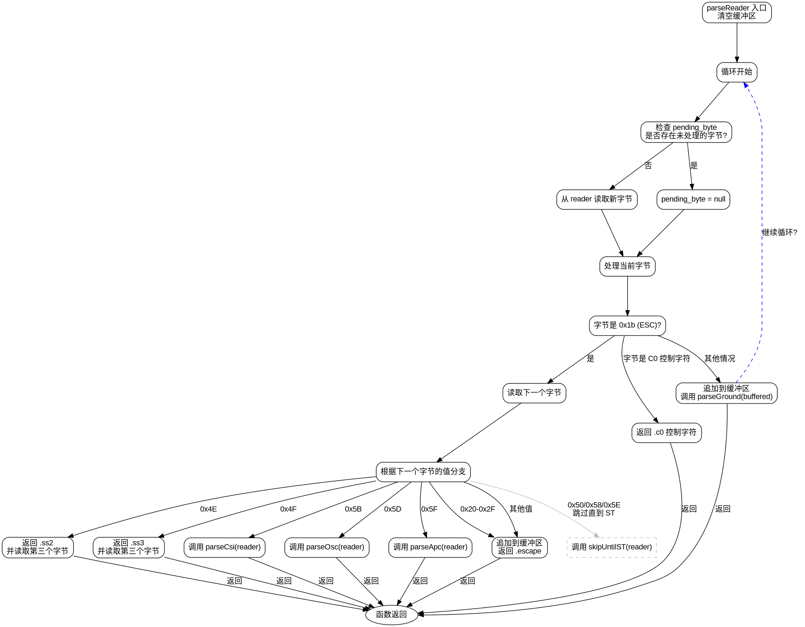

嗯，用户让我用Graphviz来画这个Zig函数的流程图。首先，我需要仔细理解这个parseReader函数的逻辑。函数的主要作用是从一个BufferedReader中读取字节并解析事件，比如转义序列或者其他控制字符。

首先，函数开始时会清空缓冲区。然后进入一个无限循环，读取字节。这里有一个pending_byte的处理，可能是之前未处理的字节。然后根据读取到的字节进行不同的处理。比如，如果是0x1b（ESC），就会进入转义序列的处理，读取下一个字节，根据不同的值跳转到不同的处理函数，比如CSI、OSC等。如果不是ESC，可能会处理C0控制字符或者进入普通字符的解析。

接下来，我需要确定流程图的结构。流程图的开始是函数入口，然后循环处理每个字节。对于每个字节，根据不同的情况分支处理。特别是处理ESC后的各种情况比较复杂，需要画出所有可能的分支，比如SS2、SS3、CSI、OSC等。此外，还有处理其他控制字符和普通字符的情况。

需要注意的是，Graphviz使用DOT语言，所以需要定义各个节点和它们之间的连接。节点应该包括判断条件，比如判断字节是否为ESC，或者判断下一个字节的值。每个分支处理完后可能会有返回事件或者继续解析。

可能会遇到的困难是如何组织复杂的条件分支，尤其是处理转义序列时的多层判断。需要确保每个分支都被正确表示，并且流程图的逻辑清晰，不会让读者混淆。

另外，用户提到不要用Mermaid，所以必须确保生成的是正确的DOT代码，符合Graphviz的语法。需要检查节点和边的定义是否正确，是否有遗漏的情况，比如处理pending_byte的逻辑，或者在解析普通字符时调用parseGround函数。

最后，生成的流程图应该覆盖函数的所有可能路径，包括错误处理（比如try可能会抛出错误），但用户提供的代码中没有显示错误处理的流程，可能只需要关注正常流程。
================================================

这个流程图的主要特点：

1. 用灰色虚线表示需要调用`skipUntilST`的特殊分支（0x50/0x58/0x5E）
2. 用蓝色虚线表示`parseGround`执行后可能继续循环的逻辑
3. 所有最终返回路径都汇聚到`end`节点
4. 严格遵循原始代码的分支结构：
   - 优先处理 pending_byte
   - ESC 序列的多层解析
   - C0 控制字符直接返回
   - 普通字符走 parseGround 分支
5. 使用Arial字体保持可读性
6. 用椭圆形表示函数入口/出口节点
7. 关键字节值直接在边标签中标注