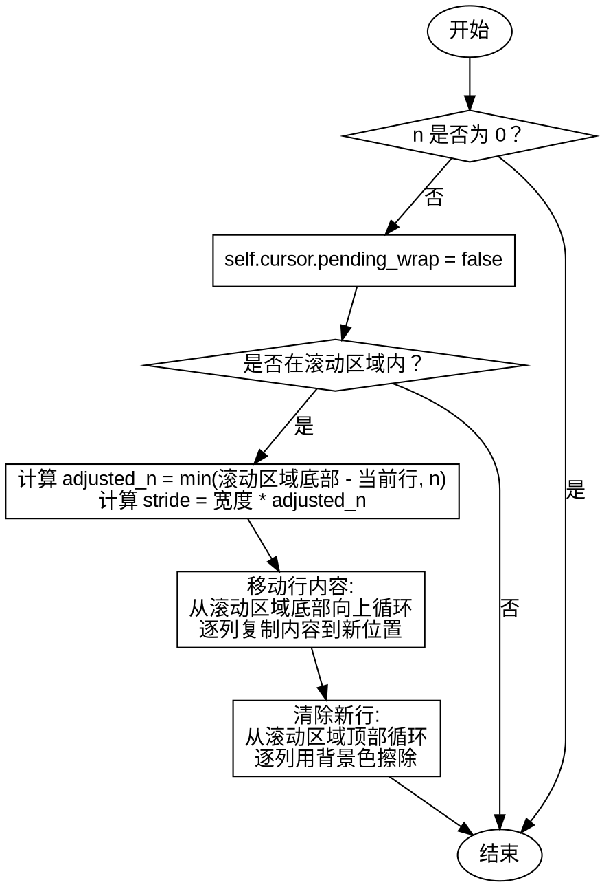

好的，我需要为这个Zig函数`insertLine`生成一个Graphviz的流程图。首先，我得仔细理解这个函数的功能和结构。

函数开始检查`n`是否为0，如果是就直接返回。然后设置`pending_wrap`为false，并检查是否在滚动区域内，不在的话也返回。接下来计算`adjusted_n`作为要插入的行数，这可能受限于滚动区域的底部和当前光标的位置。然后根据`adjusted_n`计算出步长`stride`。

接下来的两个循环部分：第一个循环是从滚动区域的底部向上移动行，将内容向下移动`adjusted_n`行。这里用到了`row -|= 1`，可能是递减操作。第二个循环是清除滚动区域顶部新腾出的行，用背景色擦除。

我需要将这些步骤转化为流程图节点。可能的步骤包括：

1. 检查n是否为0，是则返回。
2. 设置pending_wrap为false。
3. 检查是否在滚动区域，不在则返回。
4. 计算adjusted_n和stride。
5. 第一个循环处理行的移动。
6. 第二个循环处理清除新行。
7. 结束函数。

需要注意条件判断的分支，比如n=0和滚动区域的判断。循环部分可能需要表示为子流程，但Graphviz中处理循环通常用节点和边来表示，比如用“循环开始”和“循环结束”节点，并用条件箭头连接。

可能需要将循环分解为条件判断和循环体。例如，第一个循环的row从scrolling_region.bottom开始，递减直到row >= scrolling_region.top + adjusted_n。循环体内还有内层循环遍历列。同样，第二个循环从scrolling_region.top开始递增。

不过，流程图通常不会详细展开每个循环的内部步骤，而是概括为“移动行内容”和“清除新行”两个步骤。可能需要在流程图中用两个节点表示这两个循环操作，而不是详细画出每个循环的内部结构，否则流程图会太复杂。

另外，注意函数中的错误处理（try语句），但这里似乎没有错误返回点，除了可能`copyFrom`可能抛出错误，所以用try。但流程图可能不需要处理错误路径，除非特别重要。

现在开始组织这些步骤：

开始 -> 检查n==0？是的话返回，否则继续。
设置pending_wrap为false。
检查是否在滚动区域，不在则返回。
计算adjusted_n和stride。
执行第一个循环（移动行）。
执行第二个循环（清除行）。
结束。

循环部分可以简化为两个处理节点，可能加上条件判断。但需要确保逻辑正确。

可能的结构：

digraph {
    start [label="开始", shape=ellipse]
    check_n [label="n == 0?", shape=diamond]
    set_pending_wrap [label="self.cursor.pending_wrap = false"]
    check_region [label="在滚动区域内？", shape=diamond]
    compute_adjusted [label="计算adjusted_n和stride"]
    loop_move [label="移动行内容（循环处理）"]
    loop_clear [label="清除新行（循环处理）"]
    end [label="结束", shape=ellipse]

    start -> check_n
    check_n -> set_pending_wrap [label="否"]
    check_n -> end [label="是"]
    set_pending_wrap -> check_region
    check_region -> compute_adjusted [label="是"]
    check_region -> end [label="否"]
    compute_adjusted -> loop_move
    loop_move -> loop_clear
    loop_clear -> end
}

但需要确保循环中的处理正确。比如，第一个循环的条件是row >= scrolling_region.top + adjusted_n，每次递减。而第二个循环是row < scrolling_region.top + adjusted_n，递增。不过这些细节可能在流程图中用节点标签概括即可。

这样应该能正确表示函数的流程。可能还需要考虑错误处理，但函数中的try只在copyFrom时，如果发生错误会返回，但流程图中可能不需要特别表示，除非用户要求。根据问题描述，可能不需要，所以暂时忽略错误路径。
================================================

该流程图：
1. 从入口开始，首先判断输入参数 `n` 是否为 0
2. 若 `n` 非 0，设置 `pending_wrap` 标志位
3. 检查光标是否在滚动区域内，不在则直接结束
4. 计算实际要插入的行数 `adjusted_n` 和移动步长 `stride`
5. 执行行移动操作（从滚动区域底部向上逐行复制）
6. 执行新行清除操作（从滚动区域顶部向下填充背景色）
7. 最终流程结束

箭头上的标签清晰地展示了条件分支的判断逻辑，矩形节点表示操作步骤，菱形节点表示条件判断。