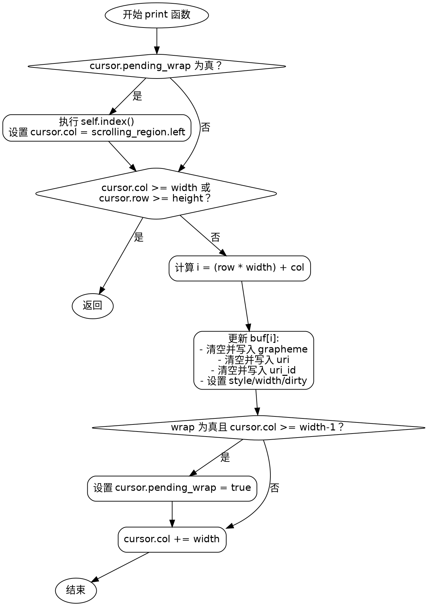

好的，我需要帮用户用Graphviz画出这个Zig函数的流程图。首先，我得仔细读一下这个print函数的代码，理解它的逻辑。

函数开始检查self.cursor.pending_wrap是否为真。如果是，就执行self.index()，然后将cursor.col设为scrolling_region.left。接下来有两个条件判断：cursor.col是否超过width，以及cursor.row是否超过height，如果任何一个条件满足，函数就返回，不做后续处理。

然后，获取当前的col和row，计算索引i，并进行越界检查。之后更新buf[i]的各种属性，比如char、uri、uri_id、style、width，并设置dirty为true。

最后，判断是否要设置pending_wrap，并增加cursor.col的值。

接下来，我需要将这些步骤转化为流程图。流程图应该包括开始和结束节点，条件判断的分支，以及各个操作步骤。需要注意条件判断后的流程走向，比如条件满足时的返回，或者继续执行后续步骤。

可能需要用到的节点形状：开始和结束用椭圆形，操作用矩形，条件判断用菱形。流程线要正确连接各个节点，特别是条件分支后的路径。

比如，开始节点是“开始print函数”。第一个判断是pending_wrap是否为真，如果是，执行index()并设置col。然后判断cursor.col >= width或者cursor.row >= height，如果是，结束流程。否则继续计算i，更新buf，处理uri等，最后处理pending_wrap和cursor.col的增加。

需要注意的是，在条件判断后的返回路径要指向结束节点。另外，各个操作的顺序要正确，比如在设置buf[i]的属性后，再处理wrap的条件和cursor的更新。

可能需要将各个步骤拆分成更细的节点，比如更新char、uri、uri_id等可以合并为一个步骤，还是分开表示？根据代码，这些是连续的操作，可以合并为“更新buf[i]的属性”这样的节点。

最后，根据这些分析，用Graphviz的DOT语言来绘制流程图的结构。确保条件分支的正确连接，以及各步骤的顺序正确。
================================================
