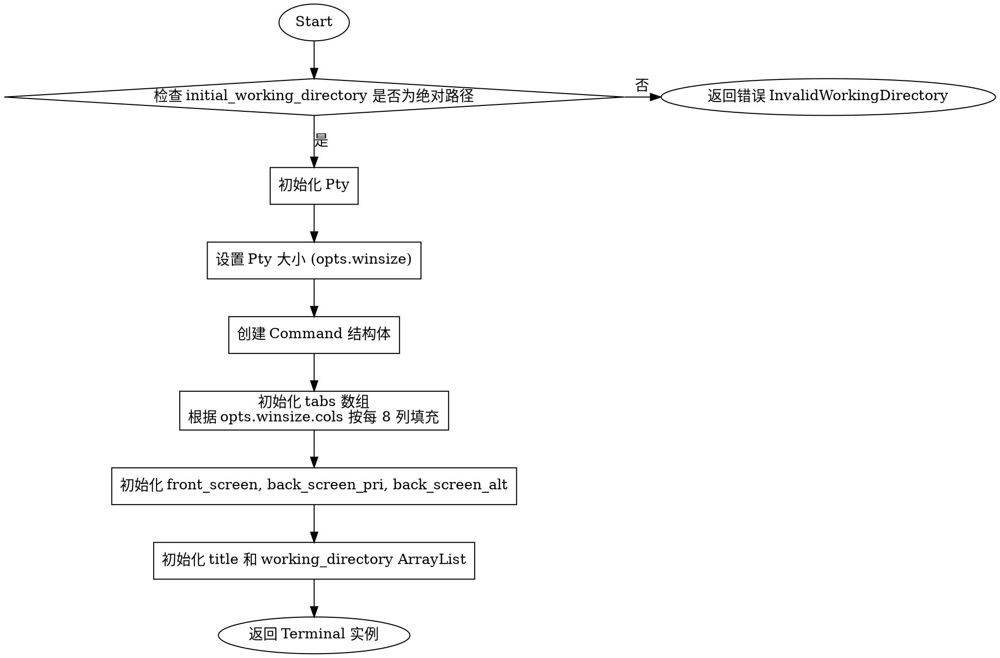

嗯，我需要为这个Zig函数画一个流程图。首先，我得仔细看看这个init函数的结构。函数开始先检查initial_working_directory是否是绝对路径，如果不是的话返回错误。然后初始化PTY，设置大小，创建Command结构体。接下来是初始化tabs数组，根据窗口的列数来填充tab的位置。最后返回Terminal结构体的实例，包含各种初始化的成员。

流程图的话，应该从函数入口开始，第一步是检查工作目录的有效性。然后是PTY的初始化和设置大小。接着构造Command对象。之后处理tabs数组的生成。最后初始化各个屏幕和列表，返回Terminal结构体。

需要注意的是条件判断的分支，比如工作目录是否有效的检查，如果无效就直接返回错误。这部分应该在流程图中体现为一个判断节点，分为有效和无效两种情况。不过原函数中如果无效就直接返回错误，所以流程图中检查不通过就直接结束流程，返回错误。

另外，初始化tabs数组那里有一个循环，将列数按每8列添加一个tab stop。这可能需要用循环结构来表示，但流程图里循环通常用判断和箭头来表示循环体。

然后创建front_screen、back_screen_pri和back_screen_alt这三个Screen实例，以及title和working_directory的ArrayList。这些步骤都是顺序执行的，所以每个初始化步骤都应该作为流程中的一个节点。

最后返回构造的Terminal对象，作为流程的结束节点。

可能需要用不同的形状来表示不同的步骤，比如开始/结束用椭圆形，操作用矩形，判断用菱形。不过graphviz中具体的节点形状需要正确使用。

现在考虑用graphviz的语法来构建这个流程图。每个步骤作为一个节点，箭头连接表示流程顺序。对于条件判断，比如检查工作目录是否绝对路径，用菱形节点，然后两个分支，一个是继续，另一个是返回错误。

不过原函数中的错误处理是直接返回，所以错误分支应该直接指向终端节点，并标注错误信息。

然后循环处理tabs数组的部分，可能需要用子流程或者用判断节点表示循环条件，但可能更简单的是用序列节点，因为循环次数是根据窗口列数计算的，可能不需要复杂的循环结构，直接表示初始化tabs数组的过程即可。

最终的结构大致如下：

开始 -> 检查工作目录是否绝对路径
检查通过 -> 初始化PTY -> 设置PTY大小 -> 创建Command对象 -> 初始化tabs数组 -> 初始化各个屏幕和列表 -> 返回Terminal对象
检查不通过 -> 返回错误

其中每个步骤都是矩形节点，判断是菱形。错误分支指向错误返回节点。

现在需要用graphviz的dot语言来编写这个流程图。注意节点之间的连接和条件分支的正确表示。
================================================
