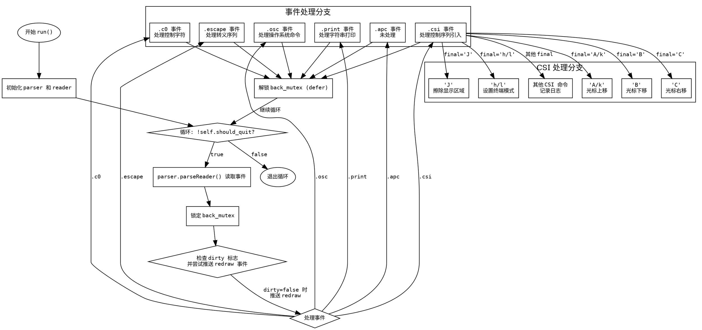

嗯，我现在需要根据提供的Zig代码中的`run`函数来生成一个Graphviz的流程图。首先，我得仔细看看这段代码的结构和逻辑。

首先，这个函数`run`是一个方法，属于`Terminal`结构体。它使用了一个`Parser`来解析输入，然后处理各种事件。主要的结构是一个`while`循环，循环条件是`!self.should_quit`。在每次循环中，它会通过`parser.parseReader`读取事件，然后根据事件的类型进行处理。

接下来，我需要分解这个函数的各个部分。函数开始初始化了`parser`和`reader`，然后在循环中处理事件。每个事件类型有不同的处理逻辑，比如`.print`、`.c0`、`.escape`、`.csi`等。每个事件类型下可能有多个分支，比如`.csi`中有很多不同的`final`字符对应的处理。

为了画流程图，我需要确定主要的流程节点。首先是初始化部分，然后是循环开始，读取事件，锁定互斥锁，处理不同的事件类型，每个事件类型下的具体操作，最后处理完事件后可能触发重绘等操作。另外，还有一些错误处理和资源释放，比如`defer`语句。

需要注意的是，代码中有很多条件分支和循环结构，比如`switch`语句中的不同case，每个case可能有不同的操作。例如，处理`.csi`事件时，根据不同的`final`字符执行不同的函数，如`cursorUp`、`cursorDown`等。

我需要将这些逻辑结构转化为Graphviz的节点和边。流程图应该从函数入口开始，然后按顺序展示初始化步骤、进入循环、读取事件、处理事件的不同分支，直到循环结束。

另外，要注意避免将所有的细节都画出来，否则流程图会过于复杂。可能需要将一些复杂的处理逻辑简化为一个节点，比如将整个`.csi`的处理作为一个节点，或者根据`final`字符分多个节点，但需要保持可读性。

可能的步骤是：

1. 开始节点：函数开始。
2. 初始化parser和reader。
3. 进入循环：检查`should_quit`。
4. 读取事件。
5. 锁定互斥锁。
6. 根据事件类型分支处理。
7. 处理每个事件的具体操作。
8. 解锁互斥锁（通过defer）。
9. 循环结束条件判断。
10. 可能的错误处理和返回。

对于每个事件类型，比如`.print`、`.csi`等，作为不同的分支节点。在`.csi`中，不同的`final`字符对应的处理作为子分支。

需要注意的是，Graphviz的语法需要使用节点和边，使用正确的方向连接。可能还需要使用子图来组织复杂的分支结构，但Graphviz的子图处理可能比较复杂，需要合理分组。

现在，我需要将上述逻辑转化为Graphviz的代码。可能需要使用不同的形状来表示不同的节点类型，比如矩形表示过程，菱形表示判断，椭圆形表示开始/结束等。

例如：

- 开始节点：椭圆形。
- 初始化步骤：矩形。
- 循环判断：菱形。
- 事件处理分支：菱形或矩形，根据是否是条件判断。

在编写过程中，需要确保每个步骤之间的连接正确，特别是循环和条件分支的流向。例如，循环的判断条件`!self.should_quit`如果为真，继续执行循环体，否则退出循环。

另外，处理事件的不同类型可能需要多个`switch`分支，每个分支对应一个处理流程。每个分支内部可能有更多的条件判断，比如在`.csi`中根据`final`字符的不同执行不同操作，这可能需要进一步的子分支。

考虑到代码的复杂性，可能需要将高层次的步骤作为主流程，而将具体的处理细节作为子流程，或者用注释说明，避免流程图过于庞大。

总结来说，流程图的绘制需要从函数入口开始，按执行顺序展示各个主要步骤，处理事件的不同分支，以及循环结构。需要合理组织节点和边，确保逻辑清晰，同时不过于复杂。
================================================
