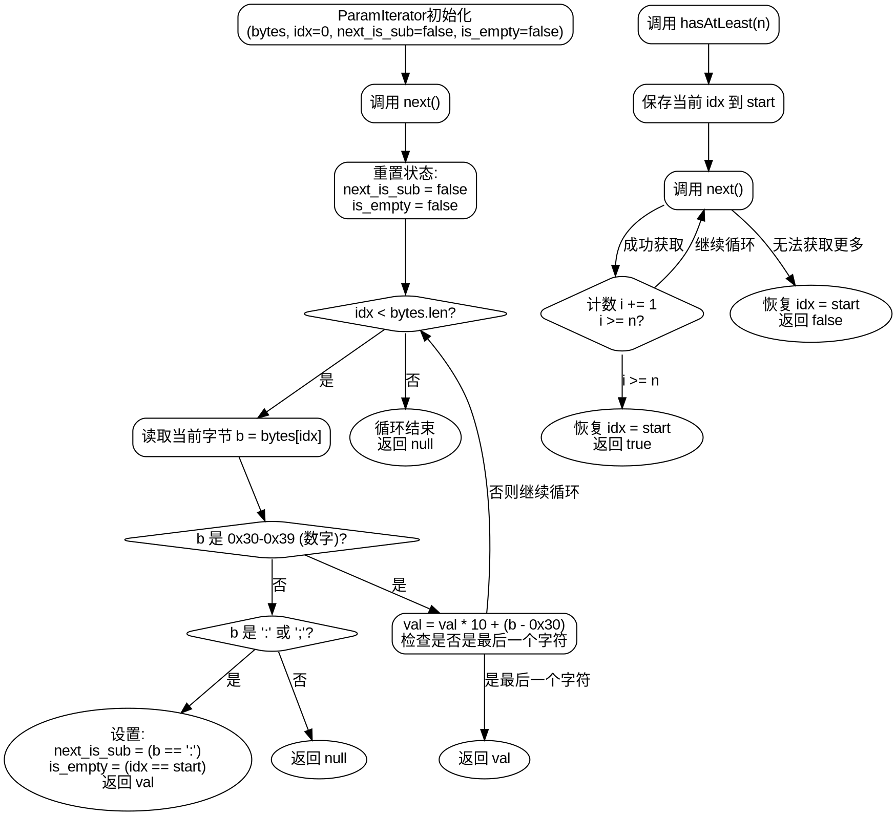

嗯，我需要为这个Zig函数ParamIterator画一个流程图。首先，我得仔细看看代码的结构和逻辑。这个函数返回一个结构体，结构体里有next和hasAtLeast两个方法。next方法负责解析字节切片中的参数，处理数字、冒号、分号等情况。hasAtLeast则是检查是否有足够多的参数。

首先，流程图应该从ParamIterator的初始化开始，包括bytes、idx、next_is_sub、is_empty这些字段的初始化。然后进入next方法，这里会有循环遍历bytes，处理每个字符。

遇到数字时，累积计算val的值，直到遇到非数字字符或者结束。如果遇到冒号或分号，设置next_is_sub和is_empty的状态，并返回当前的val。其他字符则返回null。循环结束后如果没找到有效字符，也返回null。

hasAtLeast方法需要临时保存当前idx，遍历n次next，检查是否能获取足够的参数，之后恢复原来的idx。这部分在流程图中需要体现临时保存和恢复的过程。

需要注意循环中的defer语句，idx的自增是在每次循环之后执行。此外，状态变量如next_is_sub和is_empty在每次调用next时会被重置。

可能容易出错的地方是处理数字时的边界情况，比如最后一个字符是数字的情况。另外，在hasAtLeast中，临时保存和恢复idx是否正确，否则会影响后续的next调用。

画流程图时，应该用不同的节点表示不同的判断和处理步骤，比如判断字符范围、处理数字、处理分隔符等。分支和循环结构要清晰，确保逻辑正确。
================================================
