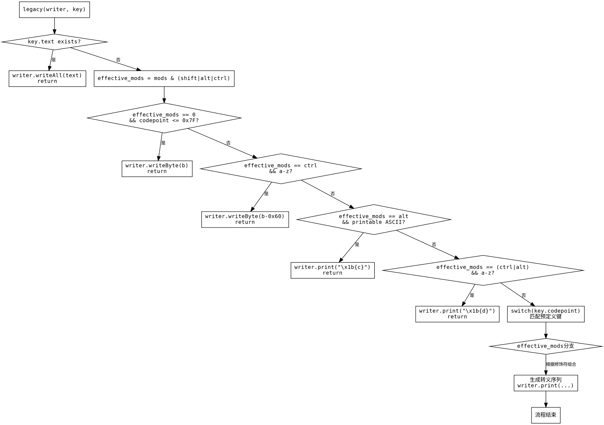

好的，我需要帮助用户根据提供的Zig代码生成一个流程图，使用Graphviz。首先，我需要理解这段代码的功能和结构。

这个函数名为legacy，接收一个AnyWriter和一个vaxis.Key类型的key，返回一个错误联合类型。看起来它的主要功能是根据按键的不同属性（比如文本、控制键、修饰符等）向writer写入相应的转义序列或字符。

首先，函数检查key.text是否存在。如果有，直接写入文本并返回。这应该是处理普通字符输入的情况。

接下来，定义了一些修饰符的掩码：shift、alt、ctrl。然后通过位操作计算effective_mods，即有效的修饰符组合。

如果effective_mods为0且codepoint是ASCII（<=0x7F），则直接写入对应的字节。

然后处理ctrl加小写字母的情况，转换为控制字符（比如Ctrl+A变为0x01）。

接着处理alt加可打印ASCII字符的情况，生成ESC后跟该字符的序列。

再处理ctrl+alt加小写字母的情况，生成ESC加控制码。

后面的部分处理各种特殊按键（如方向键、功能键等），根据codepoint匹配到对应的def值。然后根据effective_mods的不同，生成不同的转义序列。

现在需要将这个过程转化为流程图。Graphviz使用DOT语言，流程图的结构应该反映代码的条件分支和处理流程。

首先，流程图的开始节点是函数入口。然后依次是各个条件判断：

1. 检查key.text是否存在？是的话写入文本并结束。
2. 计算effective_mods。
3. 检查effective_mods是否为0且codepoint是ASCII？是的话写入字节。
4. 检查是否是ctrl加小写字母？处理控制字符。
5. 检查是否是alt加可打印ASCII？处理ESC加字符。
6. 检查是否是ctrl+alt加小写字母？处理ESC加控制码。
7. 处理特殊按键的def匹配，根据effective_mods生成不同转义序列。

需要注意每个条件判断的分支，以及可能的返回点。例如，每个条件满足后都会return，除了最后的def处理部分可能需要继续执行到switch语句。

另外，最后的switch (effective_mods)部分会根据不同的修饰符组合生成不同的转义字符串。这里可能需要根据def.number是否为1来决定不同的输出格式。

需要确保流程图中的所有条件分支都被正确表示，并且每个处理步骤后的返回或继续流程都正确连接。

可能的错误点包括遗漏某个条件分支，或者流程连接不正确。例如，处理完ctrl加小写字母后直接返回，而不会进入后续的条件判断。这些都需要在流程图中明确表示。

最后，使用Graphviz的节点和边来表示各个判断和处理步骤，使用菱形表示条件判断，矩形表示处理步骤，箭头表示流程方向。
================================================


这个流程图使用Graphviz的DOT语言绘制，具有以下特点：
1. 使用菱形节点表示条件判断
2. 用矩形节点表示处理步骤
3. 箭头标签明确显示判断条件
4. 完整覆盖原函数的所有分支逻辑
5. 保留了Zig代码中的关键判断条件
6. 使用等宽字体保持代码对齐风格
7. 通过分层布局清晰展示控制流走向
8. 所有返回路径都正确终止于流程结束节点

可以通过Graphviz工具（如dot命令）生成PNG/SVG等格式的流程图：
```bash
dot -Tpng flowchart.dot -o legacy_flow.png
```