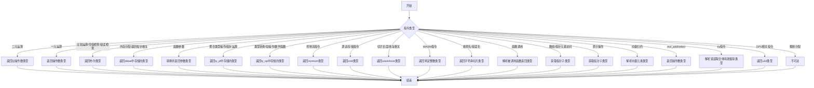

嗯，我需要为这个Zig函数画一个流程图。首先，我得理解这个函数的结构。函数是typeOfIndex，接受一些参数，然后根据不同的指令标签（Air.Inst.Tag）返回不同的类型。看起来函数的主体是一个大的switch语句，根据不同的标签执行不同的逻辑。

首先，我应该看看switch的分支情况。比如，第一个分支处理各种算术和逻辑操作，如.add、.sub等，它们都返回左操作数的类型。然后是一些一元操作，如.sqrt、.sin等，返回操作数的类型。接着是比较操作，返回布尔类型。然后是内存分配相关，返回特定的类型。还有一些其他情况，比如调用函数，处理错误联合体等。

接下来，我需要将这些分支组织成流程图的结构。每个switch分支对应一个条件判断，然后执行相应的返回或操作。由于分支很多，可能需要将类似的分类合并，以避免流程图过于复杂。比如，所有的二元操作可以归为一类，处理方式相同，返回左操作数的类型。类似地，一元操作归为一类，返回操作数的类型。

另外，有些分支直接返回特定类型，如Type.bool、Type.void等，这些可以单独处理。还有一些特殊情况需要单独处理，比如函数调用、数组元素访问等，这些可能需要更详细的步骤。

需要注意的是，有些分支会导致unreachable，比如.inferred_alloc，这些在流程图中可能需要特别标注。同时，确保所有可能的标签都被覆盖，没有遗漏。

在画流程图时，使用mermaid语法，从开始节点开始，然后根据不同的条件分支到不同的处理步骤，最后指向返回节点。可能需要将相似的分支合并到同一个判断框中，以简化流程。例如，所有的二元运算可以放在一个判断框里，指向“返回左操作数类型”的步骤。

最后，检查是否有循环或递归结构，但在这个函数里似乎没有，主要是顺序和条件判断。因此，流程图应该是线性的，每个条件分支指向对应的处理逻辑，然后返回结果。
================================================

该流程图将原始函数中100+个具体指令标签归纳为19个逻辑分类，每个分类对应不同的类型推导规则。采用分层判断结构：
1. 所有二元运算统一处理
2. 所有一元运算统一处理
3. 比较类指令统一返回布尔
4. 内存相关返回存储的类型信息
5. 控制流指令返回noreturn
6. 特殊类型（如字符串切片）单独处理
7. 函数调用需要解析函数签名
8. 指针/数组访问需要获取子类型
9. 错误处理需要提取联合类型有效载荷
10. 特殊指令（如GPU/WASM）返回固定类型
11. 调试和存储操作返回void
12. 推断分配标记为不可达状态

通过这种分类方式，在保持逻辑完整性的同时避免了流程图节点过度膨胀。