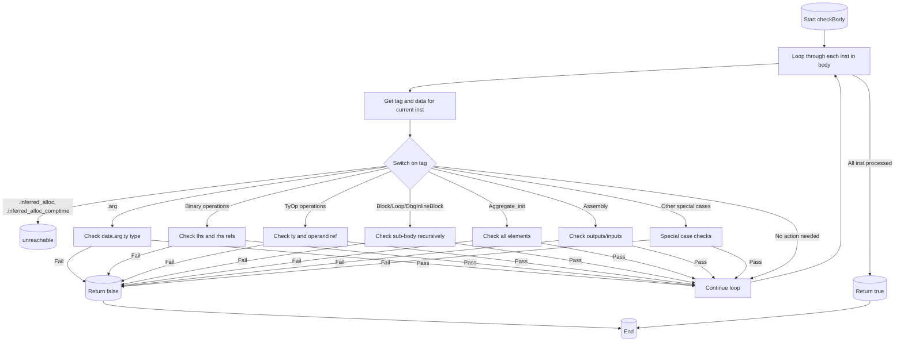

嗯，我现在需要为这个Zig函数`checkBody`画一个流程图。首先，我应该理解这个函数的功能。看起来这个函数是用来检查某种中间表示（可能是AIR，即Zig的中间表示）中的指令体（body）的有效性。函数接收一个`Air`实例、一个指令索引数组`body`和一个`Zcu`指针，然后遍历每个指令，根据不同的指令类型进行各种检查，比如类型检查和引用检查。

首先，函数开始时会获取所有指令的标签（tags）和数据（datas）。然后遍历`body`中的每个指令索引`inst`。对于每个指令，它会根据指令的标签进入不同的分支处理逻辑。每个分支可能会检查操作数的类型或引用是否有效，如果检查失败，立即返回`false`；如果所有检查都通过，最后返回`true`。

接下来，我需要考虑如何将这个过程转化为流程图。通常，流程图有开始和结束节点，中间是各种判断和处理步骤。这里主要的循环是对`body`中的每个`inst`进行遍历，然后根据不同的`tag`进入不同的处理逻辑。每个处理逻辑可能会有不同的检查步骤，但大多数情况是检查某些引用或类型，如果失败则返回false。

可能的流程图结构如下：
1. 开始节点：函数开始。
2. 循环遍历每个`inst`：对于每个指令，获取其`data`和`tag`。
3. 根据`tag`进入不同的分支，每个分支可能有多个检查步骤。
4. 每个检查步骤如果失败，直接返回false。
5. 所有指令处理完毕后，返回true。

需要注意，这个函数中有很多不同的指令标签，每个标签对应的处理逻辑可能不同，但大部分都是类似的检查模式，比如检查操作数的引用或类型。因此，在流程图中，可能需要将这些不同的分支合并为几个主要类别，而不是每个标签都单独画一个分支，否则流程图会过于复杂。

例如，可以将处理分为以下几类：
- 不需要处理的指令（如.inferred_alloc等直接unreachable）。
- 需要检查类型的指令（如.arg）。
- 需要检查两个操作数的指令（如.add, .sub等二元操作）。
- 需要递归检查子body的指令（如.block, .loop）。
- 其他特定处理逻辑的指令（如.assembly需要处理输入输出）。
- 无需任何操作的指令（如.trap等）。

在流程图中，每个主要类别可以作为一个判断分支，内部可能包含多个具体的指令处理。此外，循环遍历body中的每个inst是关键步骤，需要体现在流程图中。

另外，有些指令会递归调用`checkBody`来处理子body，比如.block和.loop，这时候流程图需要显示递归调用的过程，可能用一个子流程表示。

最终，流程图的结构可能如下：
开始 -> 遍历每个inst -> 根据tag分支处理 -> 检查条件 -> 失败则返回false，成功则继续 -> 处理完所有inst后返回true。

考虑到代码中的复杂分支结构，可能需要用多个判断节点来表示不同的tag分支，每个分支内部进行相应的检查，若任一检查失败则立即终止并返回false。对于递归调用的情况，需要用一个子流程节点表示调用`checkBody`自身。

可能还需要注意一些特殊的处理，比如`aggregate_init`中对数组或结构体元素的遍历检查，以及`switch_br`中对多个case的处理，这些在流程图中可能需要更详细的子流程。

总之，流程图需要反映函数的主要控制流：遍历每个指令，根据指令类型进行不同的检查，任何检查失败立即返回false，全部通过后返回true。
================================================

该流程图特点：
1. 用主循环遍历所有指令
2. 使用switch结构处理不同指令类型
3. 对常见模式（二元操作、类型操作、子body检查等）进行合并处理
4. 特殊指令类型单独处理（如聚合初始化、汇编指令等）
5. 任何检查失败立即终止流程
6. 支持递归调用checkBody处理嵌套结构
7. 最后统一返回最终检查结果