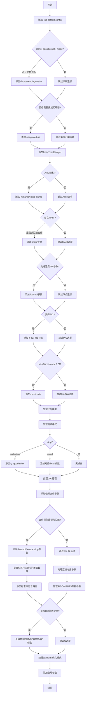

好的，我现在需要帮用户用Mermaid画出一个Zig函数的流程图。这个函数是`addCCArgs`，看起来是用于构建编译命令参数的。首先，我需要理解这个函数的结构和逻辑流程。

首先，函数接收多个参数，包括编译对象、分配器、参数列表、文件扩展名等。然后，函数内部有一系列的判断和条件分支，添加不同的编译参数到`argv`列表中。

我需要逐步分析每个条件判断和对应的操作。例如，函数一开始添加了`--no-default-config`，然后根据`clang_passthrough_mode`和文件扩展名是否支持诊断信息来决定是否添加`-fno-caret-diagnostics`。接着处理目标平台相关的参数，如`-integrated-as`，添加目标三元组，处理ARM架构的thumb模式，以及不同ABI的MABI参数等。

接下来，函数处理浮点ABI、PIC选项、MinGW的Unicode入口点、代码模型等。然后处理调试信息的格式，如CodeView、DWARF等。LTO配置、依赖文件生成、是否独立环境等。

在处理非预处理汇编文件时，添加各种系统头文件路径、框架路径等。对于汇编文件，处理特定的架构参数，如RISC-V的扩展特性、MIPS的架构参数等。对于C家族文件，处理拼写检查、目标CPU特性、操作系统特定的参数，如macOS的版本设置、Windows的pragma警告禁用等。

还有处理Sanitizer选项、优化模式对应的编译选项，最后添加全局和模块特定的编译参数。

为了画出流程图，我需要将这些步骤组织成顺序结构，并用条件分支表示各个判断。需要注意每个条件分支下的操作，并确保流程图的连贯性。可能的结构包括开始节点、一系列的条件判断节点、操作节点、结束节点。需要将每个条件（如if语句）转换为菱形判断节点，并根据不同的情况分支出不同的操作。

在转换过程中，可能会遇到复杂的嵌套条件，需要合理组织以避免流程图过于混乱。例如，处理不同文件扩展名的部分有多个条件分支，需要分别处理。此外，有些条件内部还有子条件，例如处理优化模式时，根据不同的模式设置不同的宏定义和优化级别。

最后，需要确保所有可能的路径都被覆盖，并且流程图的箭头正确指向下一个步骤。可能需要多次迭代，调整结构，确保流程图的清晰和准确。
================================================
