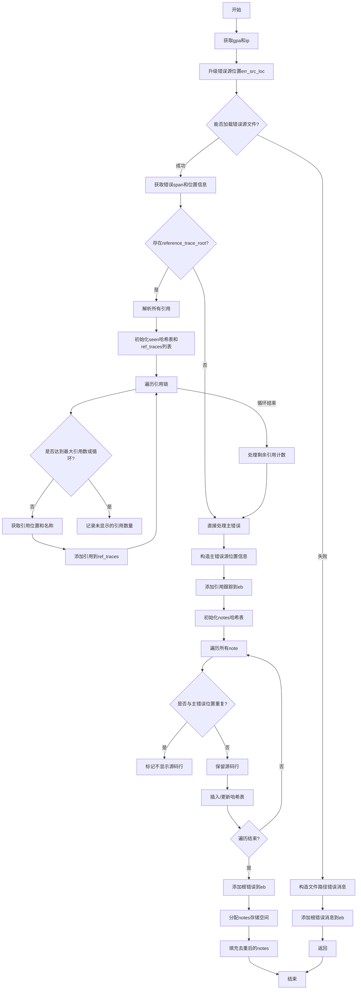

嗯，我现在需要为这个Zig函数`addModuleErrorMsg`画一个流程图。首先，我需要理解这个函数的主要流程。让我先通读一遍代码，看看它做了什么。

函数的名字是`addModuleErrorMsg`，看起来是处理模块错误消息的。参数有`zcu`、`eb`和`module_err_msg`。函数内部似乎在收集错误信息，包括源文件的位置、错误位置的行列号，以及可能的引用跟踪（reference traces）和注释（notes）。

首先，函数开始处，获取了`gpa`（通用分配器）和`ip`（InternPool）。然后升级错误源位置`err_src_loc`，并尝试获取错误源文件的内容。如果获取失败，会添加一个根错误消息，说明无法加载文件，然后返回。这部分应该是一个错误处理的分支。

接下来，获取错误的span，并找到对应的行和列。然后处理引用跟踪，这部分有一个条件判断，检查`module_err_msg.reference_trace_root`是否存在。如果存在，会解析所有相关的引用，遍历每个引用，收集信息，如文件路径、位置、名称等，并添加到`ref_traces`列表中。这里有一个循环，直到没有更多的引用或者达到最大数量限制。同时，处理重复引用，避免无限循环。

之后，处理注释部分，对每个note检查源位置，获取对应的行信息，并去重。使用哈希表来避免重复的注释条目，如果存在相同的note，则增加计数而不是重复添加。

最后，将收集到的错误信息、源位置、引用跟踪和注释添加到错误包`eb`中，包括根错误消息和相关的note条目。

现在，我需要将这些步骤转化为流程图。流程图通常包括开始、结束、处理步骤、条件判断、循环等元素。需要注意的是错误处理的分支，如无法加载源文件时的处理，以及循环处理引用跟踪的部分。此外，注释的去重处理也是一个条件判断。

可能的步骤分解：
1. 开始
2. 获取gpa和ip
3. 升级错误源位置
4. 尝试获取错误源文件内容
   - 成功：继续
   - 失败：添加根错误消息，返回
5. 获取错误span和位置信息
6. 处理引用跟踪
   - 检查是否有reference_trace_root
   - 如果有，遍历所有相关引用，收集信息，直到达到最大数量或没有更多引用
   - 处理重复引用，避免循环
7. 处理注释
   - 遍历每个note，获取源位置和行信息
   - 检查是否与主错误位置相同，避免重复显示源行
   - 使用哈希表去重，统计相同note的数量
8. 添加根错误消息到eb
9. 添加引用跟踪和注释到eb
10. 结束

在流程图中，需要将这些步骤用合适的形状表示，比如矩形框表示处理步骤，菱形表示条件判断，箭头表示流程方向。循环部分可以用循环结构或者条件判断加箭头来表示。

需要注意的一些细节：
- 在无法加载源文件时，直接返回，流程结束。
- 引用跟踪的处理是一个循环，可能需要用循环结构表示。
- 注释处理中的去重逻辑，使用哈希表来判断是否存在重复条目。
- 最后将所有的信息添加到错误包中。

可能遇到的困难是如何将循环和条件判断清晰地表达在流程图中，尤其是当有多个嵌套的条件和循环时。需要确保每个分支都有明确的出口，并且流程图的布局不会过于复杂。
================================================

流程说明：
1. 从加载源文件开始，失败时直接返回错误
2. 成功加载后解析错误位置信息
3. 处理引用跟踪链时采用循环结构：
   - 通过seen哈希表检测循环引用
   - 通过max_references控制最大显示数量
   - 动态构建reference_traces列表
4. 处理notes时：
   - 使用哈希表进行内容去重
   - 通过loc比较避免重复显示相同源码行
   - 最终批量写入去重后的notes
5. 最后将所有处理结果写入错误包(eb)并结束流程

关键判断节点用菱形表示，循环结构通过箭头回指实现，数据存储操作用矩形框表示，保持了函数中复杂的分支和循环逻辑的可视化表达。