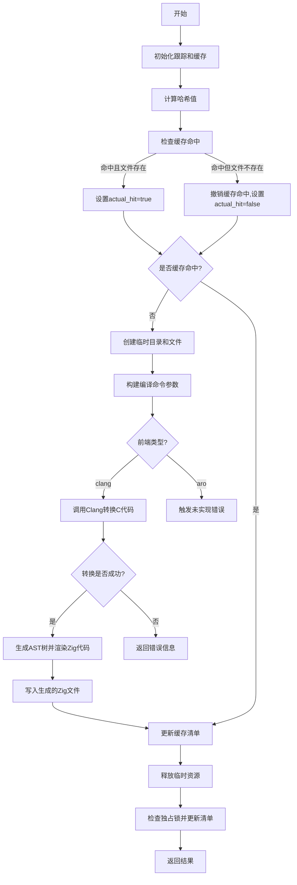

嗯，我现在需要为一个用Zig编写的函数绘制流程图。函数名是cImport，位于Compilation.zig文件中。首先，我需要理解这个函数的主要步骤和逻辑结构。

首先，函数开始处有一些开发检查，比如dev.check(.translate_c_command)，可能用于调试或跟踪。接着使用了tracy_trace进行跟踪，结束时defer tracy_trace.end()确保跟踪结束。这部分可能和性能分析有关，但在流程图中可能不需要详细体现。

接下来，定义了一个cimport_zig_basename变量，值为"cimport.zig"。然后通过comp.obtainCObjectCacheManifest获取一个缓存清单man，并在函数结束时defer man.deinit()释放资源。这里需要注意缓存管理的流程，特别是后续对man的操作。

然后，函数向man的哈希中添加了一些数据：随机数0xb945、c_src的内容和comp.config.c_frontend。这部分是为了生成唯一的哈希值，用于缓存判断。

接下来是检查缓存是否命中。首先保存当前的哈希状态prev_hash_state，然后尝试man.hit()。如果man.files.entries的长度为0，说明之前的调用可能因为Clang错误导致没有文件，因此需要unhit，并将actual_hit设为false。否则actual_hit为true。这部分逻辑需要正确反映在流程图中，特别是条件判断部分。

如果缓存未命中（!actual_hit），则进入生成新缓存的流程。这里创建了一个arena_allocator用于临时内存分配，计算临时目录路径tmp_dir_sub_path，并创建相应的目录zig_cache_tmp_dir。然后将c_src写入到临时目录中的cimport.h文件。如果开启了verbose_cimport，会记录日志。

接下来构建命令行参数argv，添加了c_frontend的名称（如clang或aro）以及其他编译参数。这里需要处理不同的c_frontend情况，比如对于clang，调用translate_c.zig的translate函数，而aro目前还未实现，会触发panic。这部分需要条件分支处理。

对于clang的情况，转换参数为带终止符的格式，调用translate函数进行C到Zig的转换。如果转换出错，返回错误结果。成功则生成tree，后续处理生成的树结构，将其渲染为Zig代码并写入到输出文件。同时处理依赖文件.d，更新缓存清单。

最后，无论缓存是否命中，如果man持有独占锁，会尝试写入更新的清单。最终返回CImportResult，包含digest、cache_hit和errors。

在绘制流程图时，需要将这些步骤分解为开始、处理缓存、条件判断、生成新缓存、处理不同前端、错误处理、写入结果等步骤，并用箭头连接。需要注意循环和条件分支，比如actual_hit的判断，c_frontend的不同处理路径，以及错误情况的处理。此外，临时目录的创建和清理，文件的读写操作也需要在流程中体现。

可能容易出错的点包括缓存命中的逻辑是否正确，不同c_frontend的分支处理，以及错误处理是否正确返回。此外，arena和临时资源的管理（如defer）需要确保在流程中正确释放，避免资源泄漏。

总结一下，流程图的大致结构应该是：

开始 -> 初始化跟踪和缓存 -> 计算哈希 -> 检查缓存命中 -> 命中则直接返回 -> 未命中则生成临时目录、处理C代码、转换、写入结果 -> 更新缓存 -> 返回结果。

其中，转换部分需要根据c_frontend分为clang和aro两个分支，目前aro未实现。另外，错误处理需要在转换失败时返回错误信息。
================================================

流程说明：
1. 初始化阶段处理跟踪和缓存对象
2. 哈希计算包含源码内容和编译配置
3. 缓存检查包含对空结果的特殊处理
4. 缓存未命中时创建隔离的编译环境
5. 参数构建支持不同C前端（当前仅clang可用）
6. 转换失败时直接返回错误信息
7. 成功转换后处理依赖关系和输出文件
8. 最终统一处理缓存更新和资源清理
9. 根据编译前端类型进行分支处理
10. 始终确保临时文件和资源的正确释放