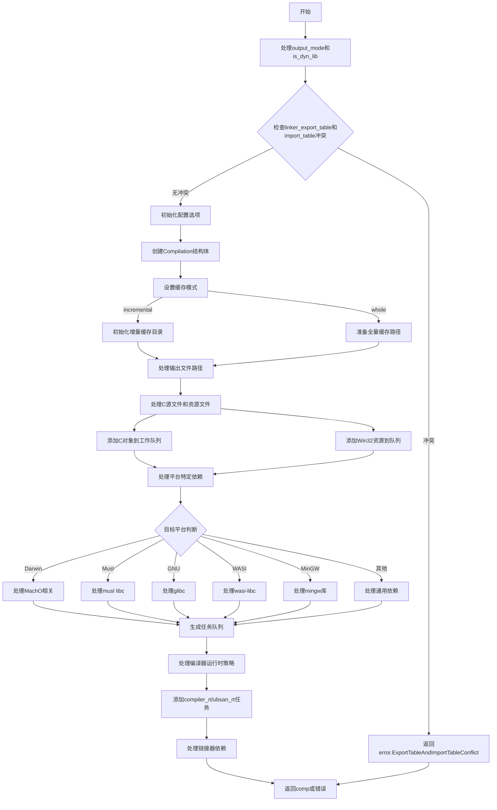

嗯，我需要帮用户用Mermaid画出一个Zig函数的流程图。首先，我需要理解这个函数的结构和逻辑。这个函数是`create`，它接收三个参数：`gpa`、`arena`和`options`，返回一个`Compilation`类型的指针或者错误。看起来这个函数主要负责初始化编译过程的各种配置和资源。

首先，我需要通读代码，理清函数的主要步骤。从代码来看，函数开始处理输出模式（`output_mode`）和动态库的判断。接着进行一些错误检查，比如检查`linker_export_table`和`linker_import_table`是否同时设置，如果有冲突就返回错误。

然后，处理各种配置选项，比如`have_zcu`、`use_llvm`，以及一些布尔标志的设置。接下来创建`comp`结构体，初始化各种字段，包括缓存设置、目录路径、编译器运行时策略（如`compiler_rt_strat`和`ubsan_rt_strat`）等。

之后，根据不同的缓存模式（`incremental`或`whole`）进行不同的处理，包括创建缓存目录、设置输出路径等。然后处理C源文件和资源文件，将它们添加到工作队列中。最后，根据目标平台的不同，处理libc、libunwind、libc++等的依赖关系，并生成相应的任务。

接下来，我需要将这些步骤分解成流程图中的各个节点。可能的节点包括：

1. 开始
2. 处理输出模式和动态库判断
3. 检查冲突（如`ExportTableAndImportTableConflict`）
4. 初始化配置选项（如`have_zcu`、`use_llvm`）
5. 创建`comp`结构体
6. 处理缓存模式（分`incremental`和`whole`）
7. 添加C源文件和资源文件到工作队列
8. 处理平台特定的依赖（如libc、libunwind）
9. 生成任务队列
10. 返回`comp`或错误

需要注意的是，流程图中需要处理条件判断，比如不同的`output_mode`、缓存模式的选择、不同平台的处理等。每个条件分支都需要对应的判断节点和不同的流程路径。

可能遇到的挑战是如何将复杂的条件分支和循环结构简化为清晰的流程图，避免过于复杂。需要确保每个主要步骤都有对应的节点，并且逻辑流向明确。

最后，按照Mermaid的语法，将这些节点和逻辑连接起来，使用条件判断（菱形节点）和不同的箭头表示流程走向。确保每个步骤的描述简洁明了，便于理解。
================================================

流程图说明：
1. 从初始化输出模式开始，检查链接器标志冲突
2. 初始化编译配置和缓存结构体
3. 根据缓存模式选择不同路径
4. 处理输入源文件和平台特定依赖
5. 根据目标平台类型分支处理不同libc实现
6. 生成编译器运行时和链接器相关任务
7. 最终返回编译对象或错误

关键判断节点用菱形表示，主要处理步骤用矩形表示，错误路径单独标出。该流程图展示了从初始化到返回编译对象的核心逻辑链，涵盖了配置处理、缓存管理、平台适配等关键环节。