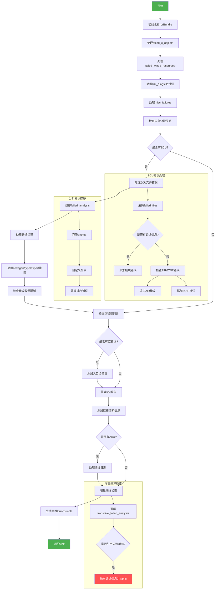

好的，我现在要帮用户用Mermaid画出他们提供的Zig函数`getAllErrorsAlloc`的流程图。首先，我需要仔细理解这个函数的逻辑结构。这个函数看起来是收集编译过程中的各种错误信息，并将它们打包成一个错误包返回。

首先，我会通读整个函数，了解各个部分的作用。函数开始初始化一个错误包的Wip（Work in Progress），然后通过多个循环处理不同类型的错误，比如失败的C对象、Win32资源、链接诊断（LLD错误）、杂项失败、内存分配失败等。接着处理与ZCU（可能是指Zig编译单元）相关的错误，包括文件解析错误、分析错误、代码生成错误、类型错误、导出错误等。之后还有一些特殊情况处理，比如错误数量超过限制、缺少入口点、缺少libc等情况。最后处理编译日志和增量编译的相关检查，并返回生成的错误包。

接下来，我需要将这些步骤转化为流程图。流程图应该从函数入口开始，按照顺序处理各个错误源，每个错误处理部分可能包含循环或条件判断。需要注意的是，函数中有多个条件分支，比如检查是否有内存分配失败、是否跳过分析、是否处于增量编译模式等。此外，有些步骤是并行的循环结构，比如处理不同类型的错误集合。

我需要注意各个部分的依赖关系和执行顺序。例如，初始化错误包后，依次处理各个错误集合，每个错误集合的处理可能涉及添加根错误信息或注释。处理完所有错误后，检查是否有未处理的错误情况，并最终生成错误包返回。

在绘制流程图时，需要将每个主要步骤作为节点，条件判断作为菱形框，循环结构用循环节点表示。例如，处理每个`failed_c_objects`的循环可以用一个循环框表示，内部调用`addToErrorBundle`。同样，处理LLD错误时，添加根错误信息和保留注释的部分需要详细展开。

还需要注意错误处理中的异常情况，例如在排序失败的分析错误时可能抛出错误，这时候流程可能需要终止或跳转到错误处理部分。不过在这个函数中，错误是通过Zig的错误处理机制返回的，所以流程图需要反映这些可能的错误路径。

最后，确保所有可能的路径都被覆盖，包括函数末尾的编译日志处理和增量编译的检查。特别是当没有任何根错误信息时，检查是否有其他错误情况，如缺少入口点或libc，并添加相应的错误信息。

总结来说，流程图的绘制需要按照函数执行的顺序，将每个处理步骤和条件判断清晰地表示出来，确保逻辑的完整性和准确性。需要注意循环结构、条件分支以及错误处理的各个部分，将它们合理组织在流程图中，使得整个函数的结构一目了然。
================================================
