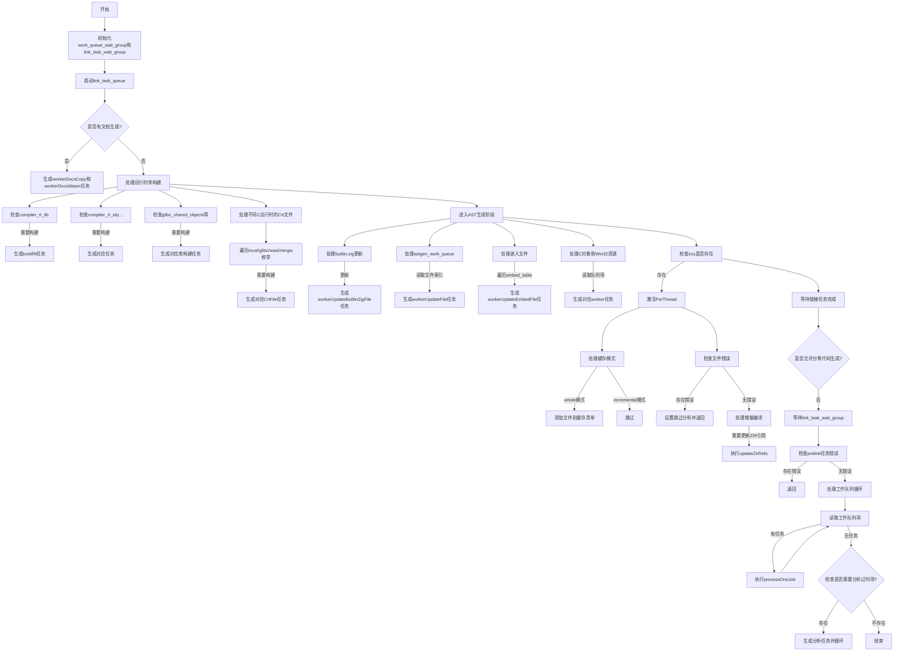

嗯，我现在需要帮用户把提供的Zig代码中的`performAllTheWorkInner`函数用Mermaid画成流程图。首先，我得先仔细阅读这段代码，理解它的结构和执行流程。

首先，函数`performAllTheWorkInner`接受`Compilation`指针和一个进度节点。看起来这是处理编译过程中的各种任务，比如生成AST、编译C对象、链接任务等。里面有很多条件判断和循环，处理不同的任务队列。

接下来，函数开始时初始化了一些等待组（WaitGroup），比如`work_queue_wait_group`和`comp.link_task_wait_group`，并在最后使用`defer`来等待它们完成。这说明这些等待组用于同步并发任务。

然后，检查`comp.link_task_queue`是否启动，如果是，就通过线程池生成一个任务来处理链接队列。这里可能涉及到多线程任务的分发和管理。

接着，处理文档生成的任务，如果`comp.docs_emit`不为空，会生成两个任务：`workerDocsCopy`和`workerDocsWasm`，并添加到等待组中。

之后是一系列的条件判断，检查`comp.queued_jobs`中的各个标志位，如`compiler_rt_lib`、`compiler_rt_obj`等，如果满足条件，就通过`spawnManager`方法将对应的构建任务（如`buildRt`）添加到链接任务的等待组中。这些任务可能是构建运行时库或相关对象文件。

然后，处理不同C运行时的Crt文件，比如musl、glibc、wasi_libc、mingw等，遍历它们的枚举字段，生成对应的构建任务。

接下来是AST生成阶段（`astgen_frame`），这里处理`builtin.zig`的更新，以及从`astgen_work_queue`读取文件索引，生成`workerUpdateFile`任务。同时，处理嵌入文件和C对象、Win32资源的工作队列，生成相应的任务。

之后，如果存在`comp.zcu`，进入PerThread激活状态，处理缓存相关的逻辑，比如在`whole`模式下将每个源文件添加到缓存清单。然后检查是否有文件加载失败，如果有则直接返回，跳过后续分析。

如果编译是增量式的（`comp.incremental`），会更新ZIR引用，并处理语义分析和代码生成的进度节点。

最后，检查是否需要等待所有链接任务完成，如果不需要单独的代码生成线程，则等待链接任务完成，并处理剩余的前链接任务。之后进入一个循环，处理工作队列中的任务，直到所有任务完成。

现在，我需要将这些步骤转化为流程图。流程图需要涵盖主要的条件分支、循环和任务分发。注意并发任务可能用并行处理框表示，但由于Mermaid的流程图是顺序的，可能需要用分支来表示不同的任务路径。

可能的结构：
1. 初始化和等待组的设置。
2. 处理链接任务队列。
3. 处理文档生成任务。
4. 按条件处理各个运行时库的构建任务。
5. 处理不同C运行时的Crt文件。
6. AST生成阶段：处理builtin.zig、文件索引、嵌入文件等。
7. 缓存处理。
8. 错误检查和返回。
9. 增量编译处理。
10. 等待链接任务完成，处理工作队列中的任务。
11. 循环处理工作队列直到完成。

需要注意条件判断的分支，比如每个`if (comp.queued_jobs.xxx)`是否成立，不同的任务分支。循环结构如`for`和`while`也需要在流程图中体现。

可能使用子流程来简化复杂的部分，比如将处理各个运行时库的部分作为一个子流程，处理Crt文件作为另一个子流程。AST生成阶段可能也是一个子流程。

同时，需要注意各个任务是如何被添加到线程池中的，这可能涉及到并行处理，但在流程图中可能需要用分支来表示不同的任务路径，而不是真正的并行。

可能遇到的挑战是如何将多线程任务分发和等待组的同步在流程图中清晰表达。可能需要使用条件判断和并行处理的符号来表示。

现在，尝试用Mermaid语法构建这个流程图，确保逻辑顺序正确，条件分支清晰。
================================================

注：由于代码逻辑复杂且包含并发/多线程操作，本图通过条件分支和聚合步骤简化表示。实际任务分发可能涉及并行执行，但Mermaid顺序图难以直接表达并行，故用分支流程示意。关键路径包括：
1. 初始化与任务队列启动
2. 文档/运行时库/C运行时构建
3. AST生成阶段
4. 缓存/错误检查
5. 工作队列处理循环