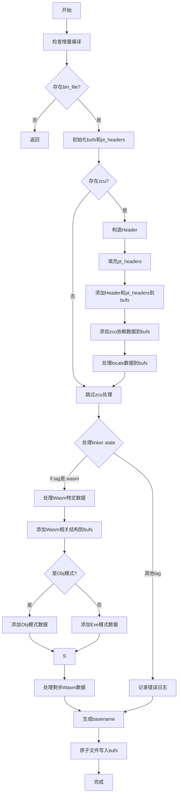

嗯，我现在需要画这个Zig函数的流程图。首先，这个函数是saveState，属于Compilation模块。看起来它的主要功能是保存编译状态，可能用于增量编译。让我仔细读一遍代码，理清逻辑步骤。

首先，函数开始处有一个dev.check(.incremental)，应该是检查是否启用了增量编译。然后检查comp.bin_file是否存在，不存在的话直接返回。接着初始化一些缓冲区和头部信息，比如bufs和pt_headers，这些都是动态数组。

接下来，处理comp.zcu，也就是Zig编译单元。这里构造了一个Header结构体，填充了各种依赖的长度信息，比如src_hash_deps_len、nav_val_deps_len等。然后遍历ip.locals，为每个local生成PerThread的头部信息，并添加到pt_headers中。之后，将这些头部信息和各种依赖的数据添加到bufs中，通过addBuf函数。这里有很多addBuf的调用，分别处理不同的数据部分，比如keys和values。

然后是关于linker state的部分，针对Wasm的情况处理。这里有很多针对Wasm特定结构的处理，比如处理字符串、函数类型、导入、导出等数据，同样通过addBuf添加到缓冲区。这里有一些TODO注释，说明有些部分还没完全实现，比如处理union字段的安全性。

最后，生成一个basename，使用原子文件操作将bufs中的数据写入文件，防止崩溃或电源故障导致状态损坏。这里用到了atomicFile，并调用了pwritevAll来写入所有缓冲区的内容，最后finish提交。

现在需要将这些步骤转化为流程图。首先，函数开始，检查条件，然后处理zcu的数据，填充头部和各部分数据到缓冲区。接着处理linker state，特别是Wasm的情况，之后生成文件名并写入文件。需要注意条件分支，比如if (comp.zcu)是否存在，以及switch (lf.tag)处理不同的链接器类型，但代码中目前只处理了.wasm的情况，其他情况输出错误日志。

可能的结构是：开始 → 检查bin_file → 初始化缓冲区 → 处理zcu → 处理linker state → 写入文件。其中处理zcu和linker state内部有多个子步骤，比如填充header，添加各个部分的数据到bufs，处理wasm的各种结构。

需要将这些步骤分块，并用条件判断来表示不同的分支，比如是否comp.zcu存在，lf.tag是否为wasm，以及is_obj的判断。同时，注意错误处理和defer语句，比如defer bufs.deinit()，但这些可能在流程图中不需要特别体现，主要关注主流程。

最后，生成basename，使用原子文件写入数据。流程图应涵盖这些主要步骤，并用条件框表示分支。
================================================
