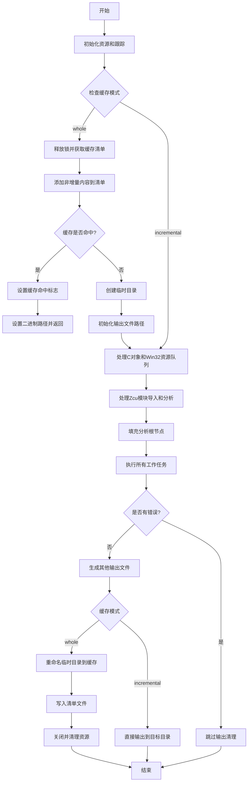

嗯，我需要为这个Zig函数`update`画一个流程图。首先，我得仔细读一遍代码，理解它的主要逻辑和分支结构。这个函数看起来像是处理编译过程的更新，涉及到缓存策略（whole和incremental两种模式），还有处理各种任务队列，比如C对象、Win32资源文件、AST生成等。此外，还有一些错误处理和清理操作。

首先，函数开始时会初始化一些资源，比如arena分配器和跟踪工具。然后根据`comp.cache_use`的值，进入不同的缓存处理逻辑。如果是`whole`模式，会检查缓存命中，如果命中就直接返回，否则进入编译流程，生成临时目录，处理输出文件。如果是`incremental`模式，则直接进入后续处理。

接下来，函数会处理C对象和Win32资源文件的任务队列，将它们加入工作队列，并记录文件系统输入。然后，处理Zig编译单元（Zcu），导入必要的模块（比如std模块），分析模块，生成测试函数等。

之后，执行所有的工作（`performAllTheWork`），处理错误，生成输出文件，最后根据缓存模式进行不同的清理和输出操作，比如重命名临时目录到缓存目录，写入清单文件，关闭文件句柄等。

在这个过程中，需要注意条件分支，比如缓存是否命中、不同操作系统下的文件处理、错误处理路径等。此外，还有各种资源的管理，比如临时目录的创建和清理，文件句柄的关闭等。

现在需要把这些步骤转化为流程图。可能需要分为几个主要部分：初始化、缓存模式处理（whole和incremental）、任务队列处理、执行工作、错误检查、输出处理和清理。每个部分内部有子步骤和条件判断。

需要注意的是，流程图中需要体现函数的主要流程和关键决策点，比如缓存命中与否、错误发生时的处理、不同操作系统的特殊处理等。同时，循环结构，比如遍历C对象表、导入表等，也需要适当表示。

可能使用不同的节点形状来表示开始/结束、处理步骤、条件判断、输入/输出等。连接线要标明流程方向，条件分支需要标注条件结果（是/否）。

此外，由于代码中存在大量的错误处理和资源清理（如defer语句），在流程图中需要体现这些清理步骤的执行时机，比如在函数结束时释放资源，或者在错误发生时跳转到清理步骤。

最后，需要确保流程图的逻辑与代码一致，没有遗漏关键步骤或分支。可能需要多次检查代码，确认每个条件分支的处理和流程的连贯性。
================================================

这个流程图描述了`update`函数的核心逻辑：
1. 初始化阶段包括资源分配和跟踪
2. 根据缓存模式（whole/incremental）分支处理
3. whole模式下的缓存检查、临时目录创建和输出重定向
4. 公共处理流程包括任务队列处理、模块分析和编译工作执行
5. 错误处理路径和最终输出阶段
6. 不同的缓存模式在最后阶段采用不同的输出策略

关键决策点用菱形表示，主要处理步骤用矩形，箭头表示流程方向。虚线框表示可选或条件路径，实际使用时可根据需要调整样式。