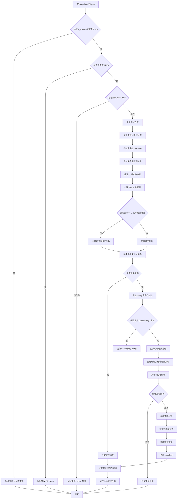

好的，我现在需要根据用户提供的Zig代码中的`updateCObject`函数，用Mermaid语法画出它的流程图。首先，我需要仔细阅读并理解这个函数的逻辑结构。

首先，函数开始处有几个条件检查：检查`comp.config.c_frontend`是否为`aro`，以及`build_options.have_llvm`是否存在。如果这些条件不满足，函数会提前返回错误。接着检查`self_exe_path`是否存在，如果不存在，同样返回错误。

接下来，函数记录调试信息，并处理之前可能的失败状态，清除之前的失败记录。然后，它初始化缓存相关的操作，比如哈希计算，处理不同的源文件扩展名，并构建命令行参数来调用Clang编译器。

在处理编译参数时，存在多个分支：比如是否启用passthrough模式，如何处理预处理器的输出，如何处理依赖文件和诊断信息等。这部分逻辑较为复杂，需要特别注意条件分支和循环结构。

然后，函数执行编译命令，可能通过子进程调用Clang，或者直接调用Clang的主函数。根据编译结果，处理成功或失败的情况，更新缓存，处理输出文件的重命名和路径管理。

最后，设置`c_object`的状态为成功，并将生成的对象文件路径等信息保存，同时触发后续的链接任务。

在绘制流程图时，需要将这些主要步骤分解为不同的节点，并用箭头连接它们，表示执行顺序和条件分支。需要注意条件判断（如if语句）会导致不同的路径，例如处理不同编译模式或错误情况。同时，循环结构如`defer`语句可能需要特殊的表示。

可能遇到的困难包括如何处理嵌套的条件判断和异常处理，例如多个`if`语句和`try`表达式。此外，函数中有多个可能的返回点，需要明确每个条件导致的流程走向。另外，缓存处理和文件操作也需要在流程图中有所体现，确保逻辑清晰。

需要确保每个步骤都准确对应代码中的操作，避免遗漏关键逻辑。同时，要合理组织流程图的层次结构，使其易于理解，不过于复杂。可能需要将一些复杂的子过程（如构建命令行参数、执行编译命令）分解为子图或单独的节点，以简化主流程。

最后，检查流程图的正确性，确保所有条件分支和循环都被正确表示，并且每个节点的操作与代码中的逻辑一致。
================================================

流程图说明：
1. 函数入口后先进行三个前置条件检查（aro/LLVM/self_exe_path），任一失败则直接返回错误
2. 通过条件检查后初始化缓存系统并处理文件哈希
3. 根据编译模式（passthrough/direct_o）构建不同的命令行参数
4. 通过子进程调用 clang 执行实际编译
5. 处理编译结果：失败时记录错误，成功时处理依赖和缓存
6. 最终更新对象状态并触发链接任务
7. 所有路径最终汇聚到结束节点

关键分支用菱形节点表示，主要操作流程用矩形节点，缓存机制和错误处理贯穿整个过程。