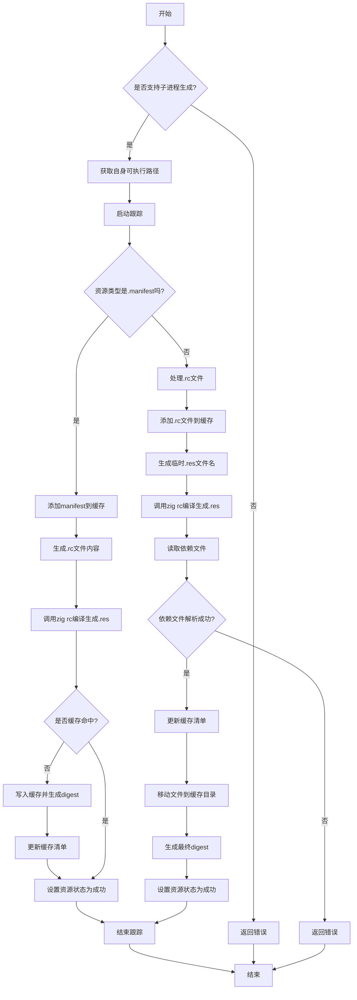

好的，我需要为这个Zig函数`updateWin32Resource`画一个流程图。首先，我要通读整个代码，理解它的主要逻辑和分支。这个函数处理Win32资源的更新，包括.rc文件和manifest文件。

首先，函数开始检查是否支持生成子进程，如果不支持则返回错误。接着获取自身可执行路径，处理跟踪和日志记录。然后根据资源类型（.rc或.manifest）进行不同的处理。

对于.manifest文件，需要生成相应的.rc和.res文件，设置资源ID和类型，调用zig rc工具进行编译，并处理缓存。对于.rc文件，处理额外的编译参数，生成临时文件，调用编译器，处理依赖文件，最后移动文件到缓存目录。

需要注意的条件分支，比如资源类型的判断、缓存是否命中的处理、错误处理等。流程图应该涵盖这些主要步骤和分支，使用不同的节点表示判断、操作、循环等。

可能的结构是：
1. 开始
2. 检查是否支持子进程生成
3. 获取自身路径
4. 处理跟踪和日志
5. 判断资源类型
   a. 如果是manifest
      i. 添加文件到缓存
      ii. 生成.rc内容
      iii. 调用zig rc编译
      iv. 处理缓存和锁
   b. 如果是.rc文件
      i. 处理额外参数
      ii. 生成临时文件
      iii. 调用编译器
      iv. 处理依赖文件
      v. 移动文件到缓存
6. 更新资源状态
7. 结束

需要确保每个条件分支都有对应的流程路径，例如缓存命中与否的处理，错误处理部分可能用不同的节点表示。同时，函数中的`spawnZigRc`调用需要作为子流程处理，但可能在主流程中简化为一个步骤。

最后，将以上步骤转化为mermaid的流程图语法，使用合适的节点和箭头连接，确保逻辑清晰。
================================================
