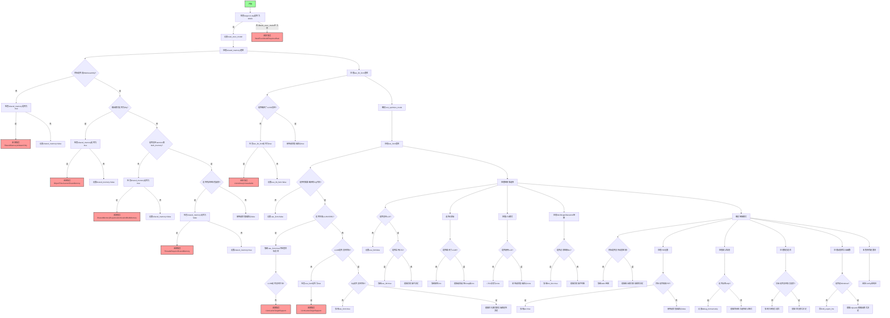

好的，我现在需要为这个Zig函数画一个流程图。首先，我需要仔细阅读并理解这个函数的逻辑。这个函数叫做`resolve`，接受一个`Options`参数，返回一个`Config`或者错误。看起来它的主要作用是根据传入的选项解析出配置，处理各种条件和错误情况。

首先，函数开始处理`target.os.tag`是否为WASI，如果不是且`wasi_exec_model`不为空，就返回错误。然后处理`shared_memory`的逻辑，这里有很多条件判断，涉及到WebAssembly的目标、输出模式是否是对象文件、是否支持原子操作和批量内存等。接着处理`use_lib_llvm`，检查是否有LLVM支持，如果没有但选项要求使用，就报错。

然后是`root_optimize_mode`，默认是Debug。接下来决定是否使用LLVM后端，这里有很多条件，比如是否生成LLVM IR或BC文件，目标是否被LLVM支持，Zig是否支持目标，是否使用LLVM库等。之后检查是否生成二进制文件，以及是否需要LLVM库。

接下来处理链接器，决定使用LLD还是Zig自己的链接器，这里涉及到目标格式是否支持LLD，是否启用了LTO等。然后是选择C前端，Clang还是Aro，根据是否有LLVM支持。LTO模式的处理，需要检查是否使用LLD。处理链接libc、libcpp、libunwind的条件，是否必须链接这些库。

然后是链接模式（静态或动态），处理各种情况，比如目标是否支持动态链接，是否链接了系统库，输出模式是否为动态库等。接着处理`import_memory`和`export_memory`，以及PIE（位置无关执行）的设置。处理剥离调试信息`root_strip`，根据优化模式和目标是否有调试信息。调试格式的选择，如DWARF或CodeView等。

之后处理错误追踪的支持，根据后端是否支持，优化模式等。处理`rdynamic`选项，动态库导出函数在Windows上的情况。最后将所有配置选项收集到`Config`结构体中返回。

现在，我需要将这些逻辑步骤转化为流程图。流程图应该从函数入口开始，按照条件判断分支展开，每个分支处理不同的情况，最终生成配置或返回错误。需要注意每个条件判断的节点和可能的路径，以及错误处理的部分。

可能需要使用不同的形状来表示开始/结束、判断节点、处理步骤和错误返回。例如，开始用椭圆形，判断用菱形，处理步骤用矩形，错误返回用带箭头的菱形或矩形。

需要注意的是，这个函数中有很多嵌套的条件判断，需要正确组织流程图的层次结构，避免交叉和混乱。可能需要将复杂的条件拆分成多个步骤，逐步展开。

比如，处理`shared_memory`的部分有多个条件，需要分步骤画出每个条件检查及其结果。同样，处理`use_llvm`的部分也有多个条件分支，需要详细展开。

另外，错误返回的情况应该明确标出，每个错误条件对应的错误类型也需要在流程图中体现。

由于这个函数非常长且条件复杂，可能需要将流程图分成几个部分，每个部分处理一个主要的配置项，如共享内存、LLVM使用、链接器选择等，然后再整合起来。

最后，需要确保流程图的正确性和完整性，覆盖所有可能的路径，特别是错误路径，这对于理解函数的逻辑非常重要。
================================================

注：由于原函数逻辑极为复杂，此流程图对主要决策路径进行了抽象和简化，实际实现中共有40+个错误返回分支和嵌套条件判断。建议结合代码注释分模块理解各配置项的解析逻辑。