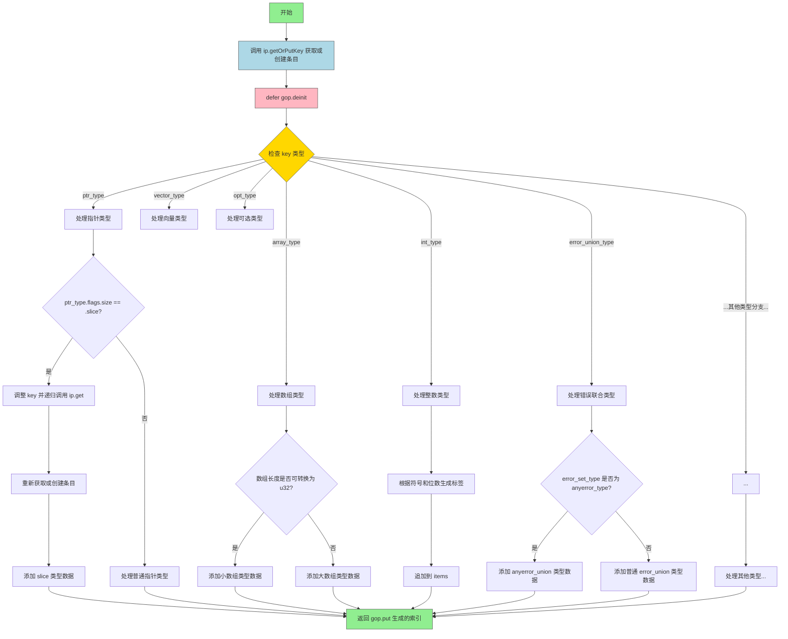

好的，我需要为提供的Zig函数`get`绘制一个流程图。首先，我会仔细阅读代码，理解其结构和逻辑流程。

函数`get`的主要功能是根据给定的`key`类型处理不同的情况，并将相应的数据添加到`items`中。看起来这是一个处理不同类型的关键字并生成相应索引的函数。代码中有大量的`switch`语句，每个`case`对应不同的`key`类型，例如`.int_type`、`.ptr_type`等，每个类型有不同的处理逻辑。

首先，我需要确定函数的主要流程。函数开始于调用`ip.getOrPutKey`来获取或创建键对应的条目。然后根据键的类型进入不同的处理分支。每个分支可能会有条件判断、数据验证、数据添加等操作。最后返回相应的索引。

接下来，我需要将每个分支的逻辑转化为流程图的节点和判断节点。例如，处理`.ptr_type`时，如果`ptr_type.flags.size == .slice`，则会调整键并递归调用`ip.get`，然后继续处理。这需要分支判断和可能的循环。

需要注意的是，某些分支中使用了`unreachable`，这意味着这些情况在其他地方处理，不需要在此函数中考虑。此外，代码中有许多`assert`语句，用于确保前提条件，这些在流程图中可能表现为条件检查。

在绘制流程图时，我会从函数的入口开始，逐步展开每个`switch case`，并处理其中的条件判断和子操作。对于递归调用`ip.get`的情况，可能需要表示为一个子流程或循环结构。

另外，需要注意函数中使用的`defer`语句，确保资源的释放，这在流程图中可能需要表示为一个固定的清理步骤。

最后，需要确保流程图清晰地展示出所有可能的路径，包括错误处理和返回点。每个分支的处理结果最终都会通过`gop.put()`返回相应的索引。

总结一下，绘制流程图的步骤如下：
1. 函数入口，调用`getOrPutKey`。
2. 处理`defer`语句。
3. 根据`key`类型进入不同的`switch case`。
4. 每个`case`内的条件判断和处理逻辑。
5. 数据验证和添加。
6. 可能的递归调用或调整键后的重新处理。
7. 最终返回结果。

需要注意代码中的复杂逻辑，如循环、递归和多个条件分支，这些都需要在流程图中明确表示。同时，保持流程图的简洁和可读性，避免过于拥挤。
================================================

该流程图特点:
1. 用黄色菱形表示主分支判断(key类型选择)
2. 用蓝色系表示关键操作(获取条目、递归调用)
3. 用粉色表示资源清理(defer)
4. 绿色表示开始/结束节点
5. 展示了主要类型分支的处理逻辑
6. 重点展示了指针类型中的递归处理流程
7. 使用省略节点表示其他类似分支的处理
8. 保持核心逻辑可见性的同时控制图表复杂度