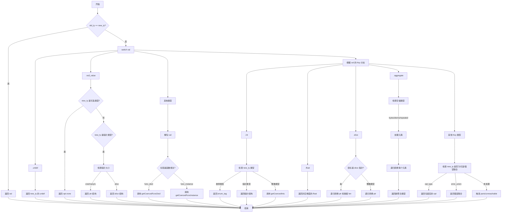

嗯，我现在需要帮用户画一个用Mermaid语法表示的流程图，基于他们提供的Zig代码中的`getCoerced`函数。这个函数看起来有点复杂，有很多条件分支和处理不同类型转换的逻辑。首先，我需要仔细阅读代码，理解它的结构，然后将其分解成不同的步骤和判断条件，最后用流程图的形式呈现出来。

首先，我会从函数入口开始。函数名为`getCoerced`，参数包括InternPool指针、分配器、线程ID、原始值和目标类型。返回值是处理后的索引或者错误。函数的主要目的是将给定的值强制转换为新的类型，如果类型相同就直接返回原值。

接下来，代码的第一个检查是判断旧类型和新类型是否相同，如果相同直接返回原值。这应该作为流程图的第一个判断节点，如果是，直接结束；如果否，继续处理。

然后，代码使用`switch (val)`来处理不同类型的值。首先是处理`undef`和`null_value`的情况。对于`undef`，直接返回新类型的`undef`。对于`null_value`，需要检查新类型是否为可选类型或指针类型，如果是，创建对应的`opt`或`ptr`/`slice`结构。这部分需要分多个分支，特别是指针类型中不同的size处理，比如`one`、`many`、`c`和`slice`。

接下来处理其他情况，比如`func_decl`、`func_instance`等函数相关的类型，这里可能需要递归调用`getCoercedFuncDecl`或`getCoercedFuncInstance`。这部分在流程图中应该作为单独的处理步骤。

然后，代码进入一个大的`switch (ip.indexToKey(val))`，处理各种不同的值类型，比如`int`、`float`、`enum_tag`、`slice`、`ptr`、`opt`、`err`、`error_union`、`aggregate`等。每个类型有不同的转换逻辑，需要分别处理。例如，整数类型可能需要转换为枚举类型或指针，浮点数需要根据目标类型调整存储方式，聚合类型（如数组、结构体）需要递归处理每个元素。

在处理聚合类型时，代码还涉及到内存分配和元素复制，需要判断存储方式（bytes、elems、repeated_elem），并递归地对每个元素进行类型转换。这部分在流程图中可能需要循环结构来表示处理每个元素的过程。

最后，如果所有前面的条件都不满足，代码会检查新类型是否为可选类型或错误联合类型，并做相应的处理。如果还是没有匹配的情况，在调试模式下会触发panic，否则直接unreachable。

需要注意的是，代码中有多处递归调用`getCoerced`，比如在处理聚合类型的元素时，或者在处理`opt`类型的payload时。这些递归调用在流程图中可能需要表示为子流程或者单独的节点。

在绘制流程图时，需要将每个主要的条件判断作为一个菱形节点，处理步骤作为矩形节点，箭头表示流程方向。由于代码结构复杂，可能需要将不同的switch case分解为多个子图，以保持流程图的可读性。例如，将处理`val`的不同类型的switch拆分为多个分支，每个分支再进一步处理具体的类型转换逻辑。

同时，需要注意错误处理和内存分配的情况，比如使用`try`关键字的地方，可能需要表示错误传播的路径，但根据函数定义，错误类型只有Allocator.Error，所以可能只需在涉及分配的地方标注潜在的错误点。

总结来说，流程图的步骤大致如下：

1. 检查old_ty是否等于new_ty，是则返回val。
2. 根据val的类型进行分支处理（undef、null_value、其他）。
3. 对于其他类型，进一步根据val的具体类型（int、float等）进行转换。
4. 处理聚合类型时，递归处理每个元素。
5. 最后处理新类型为可选或错误联合的情况。
6. 如果所有情况都不匹配，触发panic或unreachable。

需要将这些步骤转化为Mermaid的流程图语法，合理使用条件判断和子流程，确保逻辑清晰。
================================================
