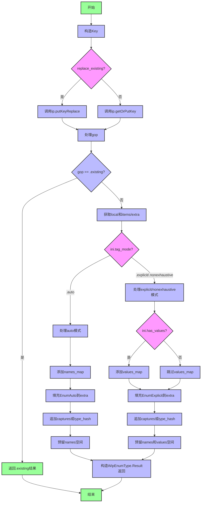

好的，我需要帮用户为这个Zig函数`getEnumType`画一个流程图。首先，我需要理解这个函数的结构和逻辑流程。让我仔细看看代码。

函数`getEnumType`的主要作用似乎是处理枚举类型的创建或获取。参数包括`InternPool`实例、分配器、线程ID、初始化信息和一个布尔值`replace_existing`。返回类型是一个`WipEnumType.Result`，可能表示新建的枚举类型或已存在的类型。

首先，函数根据`ini.key`的不同情况构造一个`key`。然后根据`replace_existing`的值决定是替换现有键还是获取或创建新键。这里使用了`ip.putKeyReplace`或`ip.getOrPutKey`，并处理可能的错误。

接下来，函数检查`gop`的结果，如果是`.existing`就直接返回已有的结果。否则，继续处理新建枚举类型的逻辑。

然后，函数根据`ini.tag_mode`的不同情况（`.auto`、`.explicit`、`.nonexhaustive`）进行不同的处理。每种模式下，都会分配必要的内存，设置额外的数据，并将信息添加到`items`和`extra`中。例如，在`.auto`模式下，需要处理字段名和可能的捕获值；而在`.explicit`或`.nonexhaustive`模式下，还需要处理字段值。

在每种分支中，都会构造一个`WipEnumType.Result`结构，包含线程ID、索引、标签类型索引、类型名称的额外索引、命名空间索引、名称映射、名称起始位置、值映射和值起始位置等信息。

需要注意的是，代码中有一些错误处理（如`errdefer`），以及在添加元素时使用`ensureUnusedCapacity`和`appendAssumeCapacity`来确保容量足够，避免分配失败。

现在，我需要将这些逻辑步骤转化为流程图。流程图应该包括开始、结束、条件判断（如`replace_existing`的判断，`tag_mode`的分支）、操作步骤（如构造key、处理gop、分配内存、添加数据等），以及可能的错误处理路径。

需要确认各个分支的流程是否清晰，特别是`tag_mode`的不同情况下的处理。此外，函数中有多个`switch`语句，需要正确映射到流程图中的条件判断节点。

可能的结构如下：
1. 开始
2. 构造key
3. 判断replace_existing，选择putKeyReplace或getOrPutKey
4. 检查gop是否为existing，是则返回existing
5. 获取local和items/extra
6. 根据tag_mode进入不同分支：
   a. .auto：处理无显式标签的情况，添加EnumAuto相关数据
   b. .explicit或.nonexhaustive：处理显式标签，可能添加values_map
7. 在各个分支中填充extra和items，处理可能的错误
8. 构造并返回WipEnumType.Result

此外，需要注意错误处理部分，例如`errdefer`在分配失败时回滚某些操作，但流程图可能不需要详细展示这些，除非用户特别要求。

现在，根据以上分析，用Mermaid语法绘制流程图。使用不同的节点表示步骤、判断和结束。确保逻辑流程正确，分支清晰。
================================================
