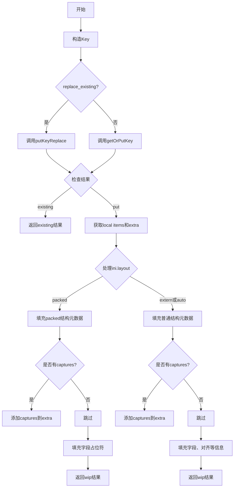

好的，我现在需要为这个Zig函数`getStructType`绘制一个流程图。首先，我需要理解这个函数的功能和结构。这个函数看起来是用于在InternPool中获取或创建一个结构体类型，处理不同的初始化情况和可能的替换。

首先，我会通读代码，了解主要的逻辑分支。函数开始处定义了一个`key`变量，根据不同的`ini.key`类型构造不同的Key结构。接下来，根据`replace_existing`参数，调用`putKeyReplace`或`getOrPutKey`方法，获取或替换现有的条目。然后，根据操作结果（新创建的条目或已存在的条目）返回相应的结果。

如果是一个新创建的条目（`gop == .put`），函数继续处理不同类型的结构体布局（如`packed`、`extern`、`auto`等），并在`extra`数组中填充相关的元数据。这里有很多条件分支，比如处理不同的初始化类型（declared、declared_owned_captures、reified），以及处理对齐、编译时字段等。

接下来，我需要识别出主要的流程节点和判断条件。例如：

1. 构造Key。
2. 根据`replace_existing`选择操作。
3. 检查是否存在现有条目，存在则直接返回。
4. 不存在时，处理不同的结构体布局（packed、extern等）。
5. 填充元数据到`extra`数组。
6. 处理不同类型的初始化参数（declared、reified等）。
7. 添加必要的字段到`items`和`extra`。
8. 返回结果。

需要注意的是，代码中有多个条件分支，如`switch (ini.key)`、`switch (ini.layout)`，以及各种if条件判断（如检查`d.captures.len != 0`）。这些都需要在流程图中体现为不同的分支路径。

可能遇到的困难是代码中复杂的嵌套条件和大量的元数据操作，需要仔细梳理每个分支的逻辑，确保流程图的准确性和完整性。此外，一些细节如错误处理（`errdefer`）和延迟释放资源（`defer gop.deinit()`）可能需要在流程图中适当标注，或者简化处理，以保持图表的清晰。

最后，根据以上分析，绘制出分步骤的流程图，使用Mermaid语法表示，确保每个判断节点和操作步骤都清晰可辨。
================================================
