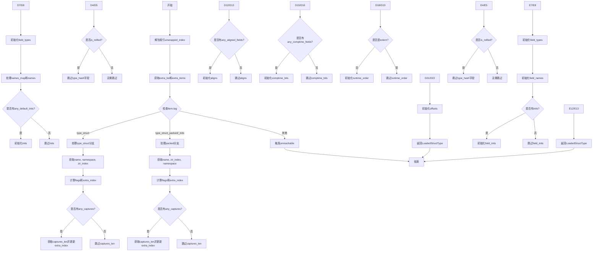

嗯，我需要为这个Zig函数画一个流程图。首先，我得仔细阅读代码，理解它的结构。这个函数叫做loadStructType，看起来是从InternPool中加载结构体类型的信息。函数内部有switch语句，根据不同的tag处理不同的情况，比如.type_struct、.type_struct_packed和.type_struct_packed_inits。

首先，我需要确定函数的主要分支。主分支是switch语句，根据item.tag的值分成了三个情况。前两种情况处理结构体的不同类型，第三种情况是默认的unreachable。每个case里面有很多步骤，比如获取extra_items中的不同字段，计算偏移量，填充结构体的各个部分。

然后，我需要将这些步骤转化为流程图的节点。对于每个case，可能会有多个步骤，比如获取name、namespace、zir_index等。还要注意条件判断，比如flags.any_captures、flags.is_reified等，这些会导致不同的路径。

需要注意的是，有些步骤是顺序执行的，而有些是基于条件的分支。比如在.type_struct的情况下，如果有any_captures，就会处理captures_len，否则跳过。类似地，flags.is_reified会增加extra_index。

可能还需要考虑变量如何在不同步骤中被更新，比如extra_index的变化，以及各个Slice的构造。不过流程图可能不需要详细到每个变量的变化，而是更关注逻辑流程。

另外，两个主要的case（type_struct和type_struct_packed/packed_inits）有不同的处理逻辑，但最终都返回一个LoadedStructType结构体。需要确保流程图中清晰地展示这两个分支的不同处理步骤。

最后，确保流程图有开始和结束节点，每个条件判断用菱形表示，步骤用矩形，箭头表示流程方向。可能还需要合并一些重复的步骤，比如初始化captures的部分，在两个case中都有类似的处理。

可能遇到的困难是代码中有很多细节，需要合理抽象，避免流程图过于复杂。需要保持每个分支的清晰，同时展示关键步骤和条件判断。
================================================
