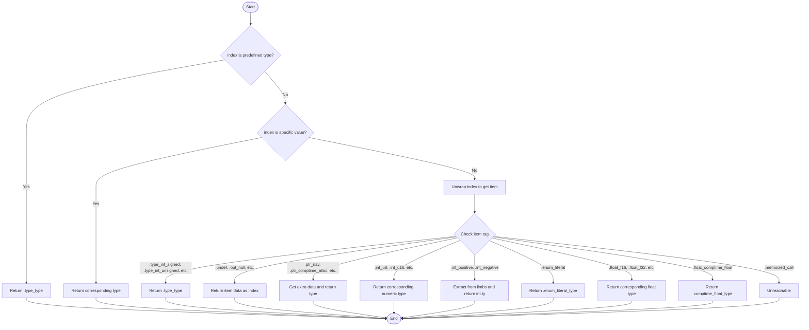

嗯，我现在需要为这个Zig函数`typeOf`画一个流程图。首先，我得仔细看看这个函数的代码结构，然后理解它的逻辑流程，这样才能正确地转化为流程图。让我先通读一下代码。

这个函数的作用是根据给定的`index`返回对应的类型`Index`。函数体主要是一个大的switch语句，处理不同的`index`情况，每个情况返回对应的类型。看起来有很多预定义的枚举成员，比如各种类型（如`.u8_type`, `.i32_type`等）和一些特定值（如`.undef`, `.zero`等），然后对于其他情况（`_`），会进一步处理，可能涉及到解包索引、检查item的tag，然后根据不同的tag进行不同的处理。

首先，我需要明确这个函数的整体结构。函数开始是一个switch语句，处理特定的`index`值，直接返回对应的类型。这些情况大部分返回`.type_type`，而其他一些如`.undef`则返回特定的类型。接下来是默认分支`_`，这里会执行更复杂的逻辑，可能需要访问`item`的tag，或者处理额外的数据。

接下来，我需要分解每个分支的情况，尤其是默认分支里的内容。默认分支首先解包索引，获取`item`，然后根据`item.tag`的不同，进行不同的处理。例如，某些tag直接返回`.type_type`，而其他tag可能需要从`extra`数据中获取类型，或者处理特定的数值类型（如`.int_u8`返回`.u8_type`）。

另外，还有一些特殊情况，比如`.int_positive`和`.int_negative`需要从`limbs`数据中获取类型，而`.float_f16`等则返回对应的浮点类型。还有一些tag会导致直接返回特定的类型，如`.enum_literal`返回`.enum_literal_type`。

现在，我需要将这些逻辑流程转化为流程图。通常，流程图的基本结构包括开始、判断节点、处理步骤和结束。对于这个函数，开始是输入index，然后根据不同的index进入不同的分支，每个分支可能有进一步的判断或处理步骤，最终返回对应的类型。

可能的流程如下：

1. 开始：输入index。
2. 检查index是否是预定义的特定值（如.u0_type, .i0_type等），如果是，返回.type_type。
3. 如果不是，检查是否是其他特定值（如.undef返回.undefined_type，.zero返回.comptime_int_type等），返回对应的类型。
4. 如果都不符合，进入默认分支：
   a. 解包index，获取item。
   b. 根据item.tag进行判断：
      i. 如果是某些tags（如.type_int_signed等），返回.type_type。
      ii. 如果是.undef等，直接返回item.data转换后的类型。
      iii. 如果是其他tags（如.ptr_nav等），则从extra数据中获取类型。
      iv. 处理特定的数值类型，如.int_u8返回.u8_type。
      v. 处理大整数类型（.int_positive等）需要从limbs数据中获取类型。
      vi. 处理枚举字面量、浮点数类型等。
5. 最后，返回对应的类型。

需要注意的是，有些步骤可能会有更复杂的子流程，比如处理.int_positive时需要访问limbs数据，这部分可能需要展开。另外，某些tag可能会导致直接返回，而另一些可能需要进一步的数据提取。

在绘制流程图时，应该用判断节点（菱形）来表示每个switch分支，处理步骤用矩形，箭头表示流程方向。需要确保每个分支都被正确覆盖，尤其是默认分支中的各个tag处理情况。

可能会遇到的困难是如何简洁地表示所有可能的tag分支，而不让流程图变得过于复杂。可能需要将某些相似的处理逻辑合并，例如所有返回.type_type的tags可以合并为一个判断节点，或者将处理extra数据的部分作为一个子流程。

总结一下，流程图的大致结构应该是：

- 开始
- 检查index是否是预定义类型，返回.type_type
- 否则检查是否是其他特定值，返回对应类型
- 否则进入默认处理：
   - 解包index，获取item
   - 根据item.tag分支到不同的处理逻辑
   - 处理每个tag对应的返回类型
- 结束，返回结果

需要确保所有可能的路径都被覆盖，并且每个判断节点都有明确的出口。此外，对于类似的处理步骤（比如多个tags返回.type_type）可以合并，以简化流程图。
================================================

流程图说明：
1. **入口**：函数开始于判断`index`是否为预定义类型（如`.u0_type`, `.i0_type`等），若是直接返回`.type_type`。
2. **特定值处理**：若非预定义类型，检查是否为其他特定值（如`.undef`, `.zero`等），返回对应类型。
3. **默认分支**：若前两步均不匹配，解包`index`获取`item`，根据`item.tag`进一步处理：
   - 若`tag`为类型定义相关（如`.type_int_signed`），返回`.type_type`。
   - 若`tag`为简单值（如`.undef`），直接映射到对应类型。
   - 若`tag`涉及指针或结构（如`.ptr_nav`），从`extra`数据中提取类型。
   - 若`tag`为具体数值类型（如`.int_u8`），返回对应的基础类型。
   - 若`tag`为大整数（如`.int_positive`），从`limbs`数据中解析类型。
   - 其他特殊类型（如浮点、枚举字面量等）直接映射。
4. **结束**：所有分支最终返回具体类型，流程终止。