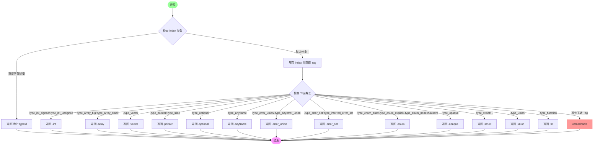

嗯，我需要为这个Zig函数`zigTypeTag`画一个流程图。首先，我得理解这个函数的结构。看起来它是一个大的switch语句，根据不同的`index`值返回不同的`TypeId`。可能还有嵌套的switch或者条件判断，特别是当处理到`_`默认情况时，又有一个内部的switch基于`index.unwrap(ip).getTag(ip)`的结果。

首先，我应该把外层的switch分成几个主要分支。比如，当`index`匹配到具体的类型时，直接返回对应的`TypeId`，比如`.int`, `.float`等。然后是默认情况`_`，这时候需要进一步检查`index.unwrap(ip).getTag(ip)`的值，再决定返回什么。

需要注意有些case会导致`unreachable`，这些可能是错误处理或者不应该执行的情况。在流程图中，这些可能需要标记为终止节点或者错误节点。

另外，函数的参数是`ip: *const InternPool`和`index: Index`，但流程图主要关注控制流，所以可能不需要详细画出参数的处理，除非有特别的条件分支依赖于这些参数的状态。

可能的步骤是：

1. 函数开始。
2. 检查`index`的值，进入不同的分支。
3. 对于直接匹配的case，返回对应的TypeId。
4. 对于默认分支`_`，进一步检查`getTag`的结果，再次分支。
5. 处理内部switch中的各个情况，返回对应的TypeId或触发unreachable。
6. 结束。

需要确保所有的case都被覆盖，包括那些导致unreachable的情况。可能用条件判断框来表示每个case，用箭头连接不同的判断和结果。

另外，考虑到代码中有多个层次的switch，可能需要使用子流程或者分组来展示内部的switch结构。例如，外层switch的默认分支进入内部的switch处理。

还要注意，有些case在内部switch中返回相同的TypeId，比如多个标签对应同一个结果，可以合并流程图的路径以避免重复。

最后，确保流程图的逻辑清晰，层次分明，方便理解函数的分支结构。
================================================

### 流程图说明：
1. **开始节点**：表示函数入口。
2. **检查 index 类型**：外层 switch 对 `index` 进行初步匹配：
   - 直接命中已知类型（如 `.u8_type`, `.f32_type` 等）时直接返回对应 TypeId。
   - 未命中时进入默认分支 `_`，需解包 `index` 并检查其内部 Tag。
3. **解包并检查 Tag**：内层 switch 根据 `index.unwrap(ip).getTag(ip)` 的结果进行二次判断：
   - 根据 Tag 类型（如 `.type_int_signed`）返回对应 TypeId。
   - 若命中无效 Tag（如 `.undef`, `.simple_value` 等），触发 `unreachable`。
4. **结束节点**：所有路径最终汇聚到结束节点。
5. **颜色标记**：
   - 绿色：开始节点。
   - 粉色：正常结束节点。
   - 红色：表示不可达路径（如 `unreachable`）。