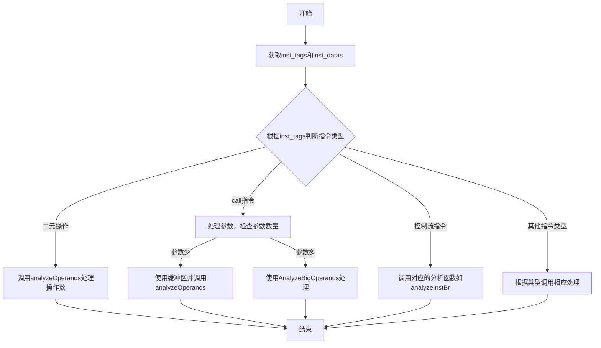
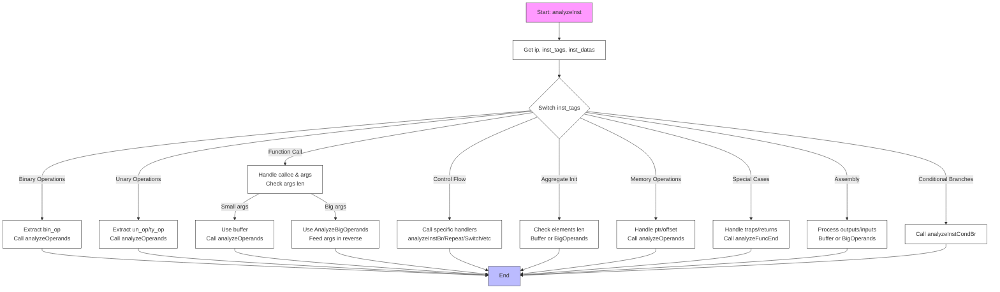

嗯，我现在需要帮用户用Mermaid画出他们提供的Zig函数analyzeInst的流程图。首先，我得先理解这个函数的结构和逻辑。看起来这个函数是一个分析指令的函数，根据不同的指令类型执行不同的操作。函数里有一个大的switch语句，根据inst_tags的不同值进入不同的分支。每个分支处理不同的指令，比如算术操作、存储操作、控制流指令等，然后调用相应的函数如analyzeOperands或analyzeFuncEnd等。

首先，我需要确定流程图的主要结构。通常，函数流程图开始于函数入口，然后根据不同的条件分支展开。这里的switch语句是关键，每个case对应不同的处理逻辑。所以流程图应该从函数开始，然后根据不同的指令类型分支出不同的处理路径。

接下来，我需要识别主要的流程节点。函数开始后，首先获取ip、inst_tags和inst_datas。然后进入switch语句，每个case对应不同的指令类型，处理不同的操作数，并调用不同的函数。例如，对于.add、.sub等二元操作，会调用analyzeOperands并传入左右操作数；对于.call指令，处理参数并可能使用AnalyzeBigOperands结构；还有一些特殊指令如.br、.repeat等会调用特定的分析函数如analyzeInstBr。

需要注意的是，有些分支处理类似，可以合并表示，比如多个算术操作共用同一个处理分支。而像.call、.assembly这样的指令处理较为复杂，需要更多的步骤，比如处理参数、处理额外数据等。

另外，异常处理和资源管理也需要考虑，比如使用defer big.deinit()来确保资源释放，这在流程图中可能需要表示为清理步骤。

不过，Mermaid流程图主要是控制流的展示，不需要涉及具体的变量操作，只需要展示函数执行的不同路径和判断节点。因此，我需要将主要的判断条件和对应的处理步骤抽象出来。

可能的步骤是：

1. 函数开始。
2. 获取inst_tags和inst_datas。
3. 根据inst_tags的值进行判断，进入不同的分支。
4. 每个分支处理对应的指令类型，可能调用不同的函数或处理操作数。
5. 结束处理，返回结果。

对于复杂的case，比如.call，需要展示参数处理和可能的两种路径（如果参数数量小于等于某个值，使用缓冲区；否则使用AnalyzeBigOperands）。这可能需要子流程或条件分支。

不过，Mermaid的流程图可能不太适合展示过于复杂的嵌套结构，因此需要适当简化，将主要的分支和关键处理步骤表示出来即可。

总结，流程图的大致结构如下：

- 开始
- 获取指令标签和数据
- 根据指令类型分支
  - 二元操作：调用analyzeOperands
  - 调用指令：处理参数，分支处理小和大参数情况
  - 控制流指令（如br、loop）：调用对应的分析函数
  - 其他指令类型处理
- 结束

在绘制时，每个主要的case分支作为一个判断节点，然后对应的处理步骤作为子节点。对于有多个处理步骤的分支，可能需要分解成多个步骤。

现在需要将这些逻辑转化为Mermaid语法。需要注意的是，Mermaid中的每个判断通常用菱形表示，处理步骤用矩形，箭头表示流程方向。

由于函数中的分支非常多，可能需要将一些相似的分支合并，例如所有二元操作可以合并为一个分支，避免流程图过于冗长。同时，对于一些复杂的case，如.call和.assembly，需要详细展示其处理逻辑中的条件判断。

可能的结构：

但需要更详细地覆盖所有主要case。例如，处理.call时需要参数处理，处理.assembly时需要处理outputs和inputs，处理聚合初始化等。

可能需要将各个主要case分支列出，但这样会导致流程图过于复杂。因此，合理的做法是按指令类别分组，例如算术操作、控制流、函数调用、内存操作等，每个类别作为一个分支，然后每个分支内部简要说明处理步骤。

最终，可能需要一个较为概括的流程图，涵盖主要处理路径，而不过度细化每个指令类型，以保持可读性。
================================================

该流程图特点：
1. 使用菱形节点表示主要switch判断
2. 按指令类型分组处理逻辑：
   - 二元/一元运算直接提取操作数
   - 函数调用区分参数数量处理
   - 控制流指令调用专用分析函数
   - 内存操作处理指针和偏移量
3. 通用模式：
   - 小操作数使用缓冲区
   - 大操作数使用AnalyzeBigOperands
   - 反向填充操作数（while循环i--）
4. 特殊节点用不同颜色标注开始和结束
5. 保持逻辑主干清晰，合并相似处理路径