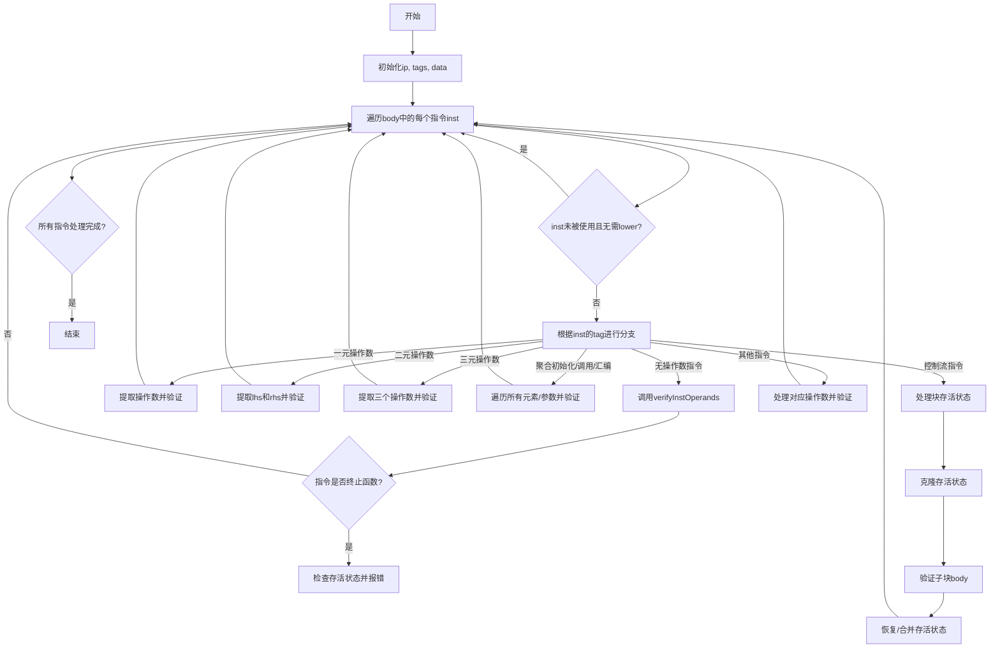

好的，我需要帮用户用Mermaid画出这个Zig函数的流程图。首先，我得理解这个函数的结构和逻辑。这个函数是`verifyBody`，属于Liveness/Verify模块。它遍历一个指令体（body），对每个指令进行各种检查，根据不同的指令类型调用不同的验证方法。

首先，函数开始时会获取`ip`、`tags`和`data`，然后遍历每个指令。对于每个指令，首先检查是否未被使用且不需要被Lower，如果是的话就跳过。接下来是一个大的switch语句，根据不同的指令标签（tag）处理不同的情况。

每个case处理不同的指令类型，比如无操作数、一元、二元、三元操作，还有控制流指令如条件分支、循环、块等。每个case中会提取相应的操作数，调用`verifyInstOperands`，并根据需要检查存活状态，如果发现错误则返回invalid。

对于控制流结构，如`br`、`loop`、`cond_br`、`switch_br`等，函数需要处理块的存活状态，可能需要克隆当前的存活状态，验证子块，然后恢复或合并存活状态。

现在，我需要将这些逻辑转化为流程图。流程图应该从函数入口开始，然后循环处理每个指令，根据不同的指令类型分支到不同的处理逻辑，最后结束循环并结束函数。由于代码中有大量的switch case，我需要概括主要的分支，而不是每个具体的指令标签。

可能的步骤：
1. 函数开始，初始化变量（ip, tags, data）。
2. 遍历body中的每个指令。
3. 检查指令是否未被使用且不需要lower，如果是则跳过。
4. 进入switch语句，根据不同的指令类型处理。
5. 处理无操作数指令，调用verifyInstOperands，检查是否终止函数。
6. 处理一元操作数指令，提取操作数并验证。
7. 处理二元操作数指令，类似步骤。
8. 处理三元操作数指令。
9. 处理聚合初始化、调用、汇编等需要处理多个操作数的指令。
10. 处理控制流指令（如br、loop、cond_br等），处理存活状态的克隆、子块验证、合并状态。
11. 检查是否有存活的指令，如果有则报错。
12. 循环结束，函数结束。

需要注意循环中的控制流处理可能涉及递归调用verifyBody，但流程图可能不需要详细展开递归，而是用子流程块表示。

现在，我需要将这些步骤用Mermaid的流程图语法表示出来，确保结构清晰，分支合理。
================================================

这个流程图概括了函数的主要执行逻辑：
1. 初始化后进入指令遍历循环
2. 对每个指令进行使用检查
3. 根据指令类型分支到不同的处理逻辑
4. 处理操作数验证和特殊控制流
5. 循环直到所有指令处理完成
6. 特别处理了控制流指令的存活状态管理
7. 保持了循环结构的清晰表达

对于复杂的分支（如switch中数十个case），用类别分组（一元/二元/控制流等）进行抽象，而不是逐个绘制每个case，以保持可读性。