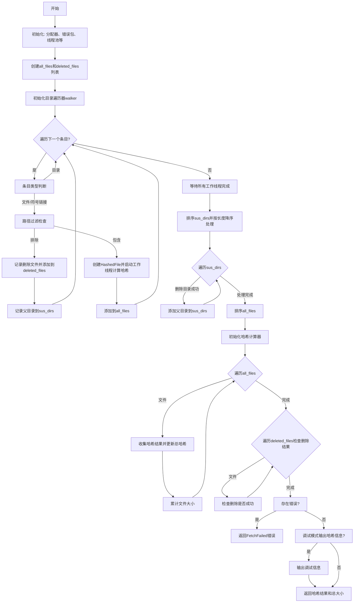

好的，我现在需要帮用户用Mermaid画出他们提供的Zig函数`computeHash`的流程图。首先，我需要仔细阅读并理解这个函数的结构和逻辑。

这个函数的主要目的是计算包的哈希值。看起来它会遍历指定目录下的所有文件，根据过滤条件决定是包含在哈希计算中还是删除。同时，还需要处理可能出现的错误，比如无法删除文件或计算哈希失败的情况。

首先，我会将函数分解成几个主要部分：

1. **初始化阶段**：创建一些数据结构，比如`all_files`和`deleted_files`的数组，初始化arena分配器，错误处理等。
2. **遍历目录**：使用`walker`遍历根目录下的所有条目（文件和子目录），对每个条目进行处理。
3. **处理每个条目**：
   - 如果是目录，跳过。
   - 根据过滤条件判断是否包含该文件。如果不包含，将其添加到`deleted_files`并计划删除，同时记录父目录到`sus_dirs`。
   - 如果包含，创建`HashedFile`结构体，启动工作线程计算哈希。
4. **处理删除的目录**：排序`sus_dirs`，尝试删除可能变为空的目录。
5. **排序文件并计算哈希**：对`all_files`排序，逐个处理哈希结果，汇总到总哈希值中。
6. **处理错误和输出调试信息**：如果有错误发生，收集错误信息；如果开启调试模式，输出哈希信息。
7. **返回结果**：最终的哈希摘要和总大小。

接下来，我需要将这些步骤转化为流程图。流程图通常包括开始、结束、处理步骤、条件判断、循环、并行处理等元素。由于这个函数中有多线程处理（例如`thread_pool.spawnWg`），可能需要用并行处理的符号来表示。不过，Mermaid的流程图语法不支持直接的并行符号，但可以通过分支和子流程来表示。

可能的挑战是如何准确表示多线程任务和等待组（`wait_group`）。例如，当遍历文件时，每个文件处理可能会生成一个工作线程来删除或计算哈希。主线程需要等待所有工作完成后再继续。这部分可以用一个子流程来表示，包括生成多个任务，然后等待它们完成。

另外，处理目录删除的部分需要循环处理`sus_dirs`，并在每次删除后可能添加新的父目录到`sus_dirs`中。这可能需要一个循环结构，直到所有相关目录都被处理完毕。

错误处理也是关键部分。在遍历文件、计算哈希、删除文件等步骤都可能发生错误，这些错误会被收集到`error_bundle`中，并在最后统一检查是否有错误，决定是否返回失败。

现在，我需要将这些步骤结构化为流程图块，并确保逻辑顺序正确。可能需要将某些步骤合并或分拆，以保持流程图的清晰。例如，遍历目录和处理每个条目可以作为一个循环块，内部有条件分支处理包含或排除文件。

最后，要确保所有可能的路径都被覆盖，包括错误路径和正常流程，以及调试信息的输出。
================================================

注：此流程图省略了部分错误处理细节（如walker遍历时的错误捕获），但保留了主逻辑分支。多线程任务通过“启动工作线程”和“等待完成”节点表示，实际实现中这些任务并行执行但流程图中用顺序结构简化。