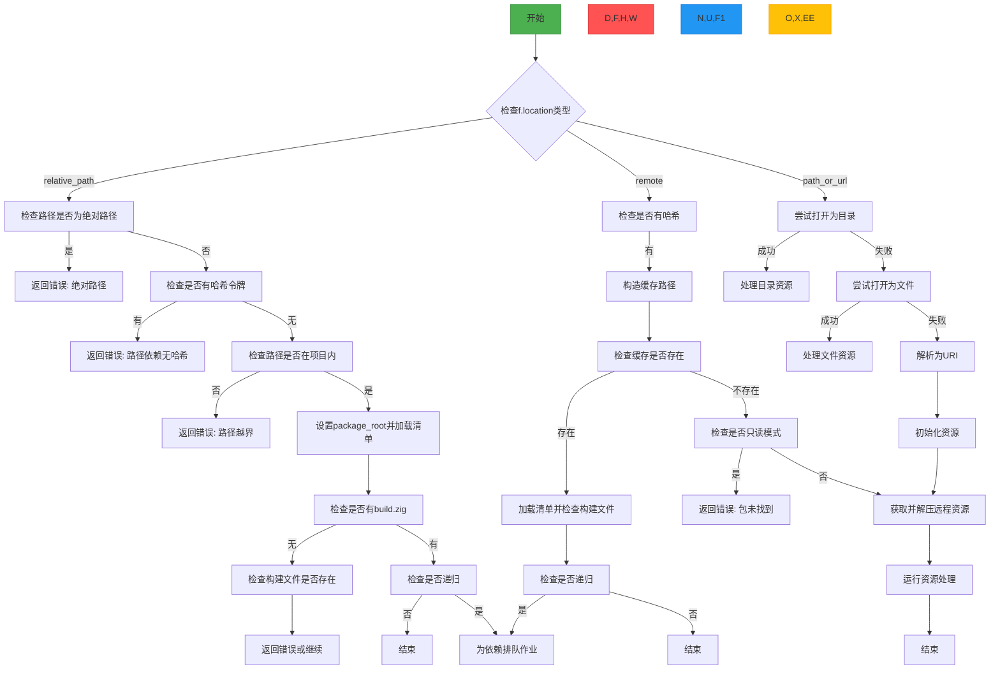

好的，我需要为提供的Zig代码中的`run`函数绘制一个流程图。首先，我需要仔细阅读代码，理解其逻辑结构和各个分支。

函数`run`的参数是一个`Fetch`结构体的指针，返回类型是`RunError!void`。主要逻辑处理不同的包位置（相对路径、远程URL、路径或URL），并根据不同情况进行处理。

首先，函数检查`f.location`的类型：
1. 如果是`relative_path`，则进行一系列检查，确保路径是相对路径，没有哈希令牌，路径在项目内，然后加载清单并处理依赖。
2. 如果是`remote`，则处理远程包的哈希检查，查看缓存是否存在，存在则直接使用，否则进行获取。
3. 如果是`path_or_url`，尝试作为本地路径或文件处理，失败则解析为URI获取资源。

接下来，需要将这些条件分支转化为流程图。使用Mermaid的流程图语法，从函数入口开始，根据不同的条件分支出不同的处理步骤。

需要注意的是，代码中存在嵌套的条件和错误处理，比如`switch`语句中的多个情况，以及可能的错误返回。流程图需要清晰展示这些分支和可能的错误路径。

另外，处理远程资源时，涉及到缓存检查、哈希验证、资源获取和解包等步骤，这些步骤需要按顺序排列，并连接相应的条件判断。

最后，确保流程图的每个节点都有明确的描述，并用箭头表示控制流的转移，包括错误处理和正常流程的继续。
================================================
