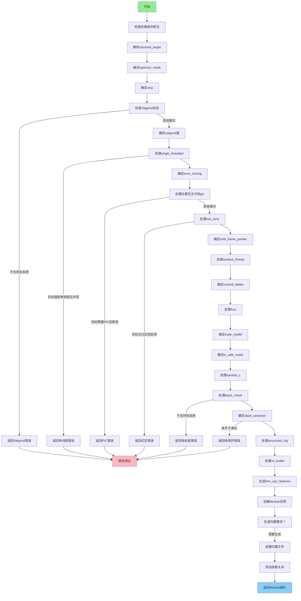

好的，我需要为这个Zig函数绘制一个流程图。首先，我需要理解这个函数的结构和逻辑。这个函数名为create，接受一个分配器（arena）和选项（options），返回一个指向Package.Module的指针或错误。

首先，函数开始时有一系列的assert语句，检查options中的某些条件。例如，如果inherited.sanitize_thread为true，则必须确保global.any_sanitize_thread也为true。这些是前置条件的检查，确保输入参数的合法性。

接下来，函数解析resolved_target，optimize_mode，strip，valgrind等变量。这里有很多条件判断，根据不同的条件选择不同的值。例如，resolved_target使用options.inherited.resolved_target或options.parent的resolved_target。

然后，处理single_threaded，error_tracing，pic（位置无关代码），red_zone（红区），omit_frame_pointer（省略帧指针）等设置。这些设置涉及到目标平台的特性检查，比如是否支持Valgrind，是否需要PIC等。

之后，处理sanitize_thread，unwind_tables（展开表），fuzz测试，code_model（代码模型），is_safe_mode（安全模式），sanitize_c（C语言清理），stack_check（栈检查），stack_protector（栈保护），structured_cfg（结构化控制流），no_builtin（禁用内建函数），llvm_cpu_features（LLVM CPU特性）等。每个变量的赋值都涉及多个条件判断，可能包括错误处理。

然后，创建mod实例，并初始化其各个字段。接着处理opt_builtin_mod，可能生成内建模块，并处理缓存和哈希。最后，如果存在内建模块，将其添加到mod的依赖中。

绘制流程图时，需要将这些步骤分解为不同的节点，并用箭头表示流程。条件判断需要分支，错误处理需要终止流程或返回错误。可能需要使用不同的形状，如矩形表示操作，菱形表示判断，椭圆形表示开始和结束。

需要注意，代码中有很多嵌套的条件判断，例如if语句内部还有if语句，这需要仔细处理流程的分支。例如，处理valgrind时有多个条件判断，每个条件可能导致不同的结果或错误返回。

在绘制时，可以按代码顺序逐步展开每个变量的处理过程，将每个条件判断作为分支点。对于错误返回的情况，可以直接指向错误处理的流程或终止节点。

最后，生成内建模块的部分可能比较复杂，涉及到缓存的创建和文件处理，这部分可能需要单独的流程子图来表示。

总结来说，流程图的大致步骤是：
1. 检查前置条件（assert）
2. 解析各种配置变量（resolved_target, optimize_mode等）
3. 处理目标平台相关设置（single_threaded, pic等）
4. 创建mod实例并初始化
5. 处理内建模块（opt_builtin_mod）
6. 添加依赖并返回mod

在绘制时，需要详细展开每个步骤中的条件判断和可能的错误返回路径。
================================================

流程图说明：
1. **菱形节点**表示条件判断
2. **矩形节点**表示操作步骤
3. **红色节点**表示错误终止
4. **绿色节点**表示流程开始
5. **蓝色节点**表示成功返回
6. 所有错误路径最终指向统一的错误终止节点
7. 主要逻辑分支包括：
   - 各种目标平台特性检查
   - 参数继承关系处理
   - 安全模式相关配置
   - LLVM特性生成
   - 内置模块的创建

具体实现细节：
1. 每个配置参数（如strip/valgrind等）都包含多级继承逻辑（global > parent > default）
2. 内置模块生成涉及哈希计算和缓存处理
3. 栈保护机制需要综合考虑多个条件（链接模式、目标支持等）
4. LLVM CPU特性需要动态生成特征字符串