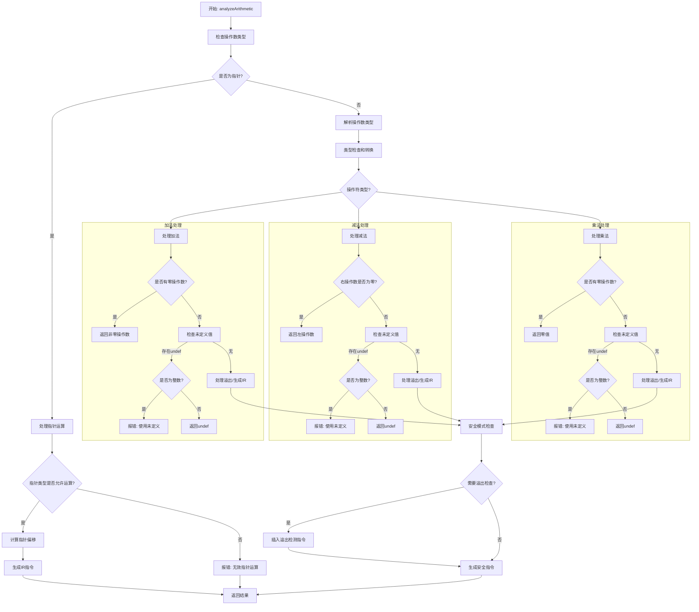

好的，我需要为这个Zig函数`analyzeArithmetic`画一个流程图。首先，我得仔细看看这个函数的结构和逻辑。看起来这个函数处理各种算术操作，比如加法、减法、乘法，并考虑了指针运算、类型检查、溢出处理等情况。

首先，函数开始时会检查操作数的类型，特别是处理指针的情况。如果两个操作数都是指针，并且不是切片类型的指针，那么只有在减法操作时才会被允许，否则会报错。这里可能需要一个分支来处理指针运算的情况。

接下来，对于非指针的情况，函数会尝试解析操作数的类型，并进行类型转换。然后根据不同的算术操作符（如add, sub, mul等）处理不同的情况，包括处理整数溢出、浮点数的特殊情况，以及处理编译时已知的值和运行时值的情况。

在处理每个操作符时，函数会检查操作数是否为零或者未定义（undef），并据此优化或报错。例如，加法中如果有操作数是零，直接返回另一个操作数。如果有未定义的值，则会根据类型是整数还是浮点数来处理错误或者返回未定义的结果。

之后，函数会生成相应的中间表示（IR）指令，比如add、sub、mul等，并考虑安全模式下的溢出检查。在安全模式下，可能会插入溢出检查的指令，并在检测到溢出时触发panic。

整个函数的逻辑分支非常多，需要仔细梳理每个条件判断和处理流程。可能的难点在于如何将复杂的条件分支和嵌套结构转化为清晰的流程图，确保每个可能的执行路径都被正确表示。

可能需要将流程分为几个主要部分：
1. 处理指针运算的逻辑。
2. 类型检查和转换。
3. 根据不同的操作符处理不同的算术情况。
4. 处理编译时已知值和运行时值。
5. 安全模式下的溢出检查和指令生成。

每个部分内部又有多个分支，需要逐一分解。例如，处理指针运算时，分为指针减法和指针与其他类型的运算；处理加法时，分为普通加法、包裹加法、饱和加法等。

在绘制流程图时，使用不同的节点表示条件判断、处理步骤和返回结果。确保每个判断条件明确，处理步骤简洁，避免过于复杂的交叉连线。可能还需要使用子流程来处理重复的逻辑，比如溢出检查的部分。

最后，检查流程图的完整性和准确性，确保所有可能的执行路径都被覆盖，没有遗漏重要的逻辑分支。
================================================
