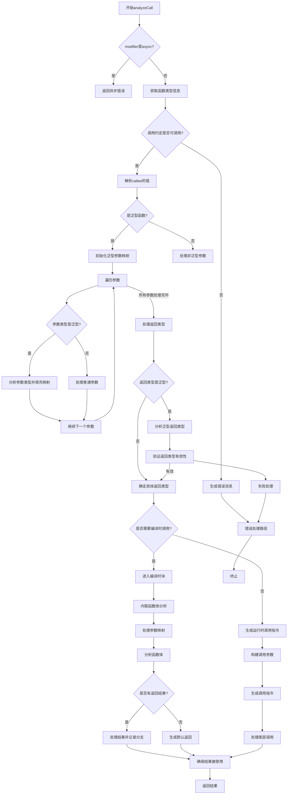

嗯，我现在需要为这个Zig函数`analyzeCall`画一个流程图。首先，我需要理解这个函数的结构和逻辑流程。这个函数看起来处理函数调用分析，包括处理不同的调用修饰符、参数分析、泛型处理、内联调用等。

首先，我应该通读代码，确定主要的分支和逻辑步骤。例如，函数开始时检查`modifier`是否为`async`，如果是的话返回错误。然后处理函数类型的信息，检查调用约定是否可调用。接下来，解析被调用函数的值，处理泛型函数的情况，检查参数类型是否符合要求。

在处理参数时，函数会遍历所有参数，分析每个参数的类型，并根据是否是泛型函数来处理不同的情况。之后，处理返回类型，特别是泛型返回类型的情况。然后根据是否是内联调用或编译时调用，分支出不同的处理路径，比如生成运行时调用或内联展开函数体。

对于内联调用，函数会处理参数映射、依赖声明，并递归分析函数体。最后处理结果，确保结果被使用，并处理可能的错误情况。

接下来，我需要将这些步骤分解成流程图中的各个节点，并确定它们之间的连接。可能的分支包括错误处理、泛型处理、内联调用处理、返回类型处理等。

需要注意循环结构，例如遍历参数的部分，可能需要用循环节点表示。条件判断如`if (func_ty_info.is_generic)`等需要作为条件分支节点。

另外，代码中有很多错误处理和提前返回的情况，这些需要在流程图中体现为终止节点或错误处理分支。

可能遇到的挑战是如何将复杂的逻辑简化成清晰的流程图，避免过多的细节导致图表难以理解。需要抓住主要步骤和关键决策点，合理分组相关操作。

现在，我需要将这些思考整理成一个结构化的流程图，使用Mermaid语法表示。可能需要使用子图来分组处理泛型、内联调用等部分，确保流程图的层次清晰。
================================================

该流程图关键点说明：
1. 从函数入口开始进行异步修饰符检查
2. 处理函数类型和调用约定验证
3. 分支出泛型/非泛型参数处理路径
4. 参数遍历分析形成循环结构
5. 返回类型处理包含泛型解析分支
6. 编译时调用和内联展开专用路径
7. 运行时调用生成单独分支
8. 错误处理贯穿整个流程
9. 最终统一处理结果验证和返回

通过条件判断和子处理块的组合，展现了复杂类型推导、泛型实例化、编译时/运行时路径选择等核心逻辑，同时保持了主要流程的线性可读性。