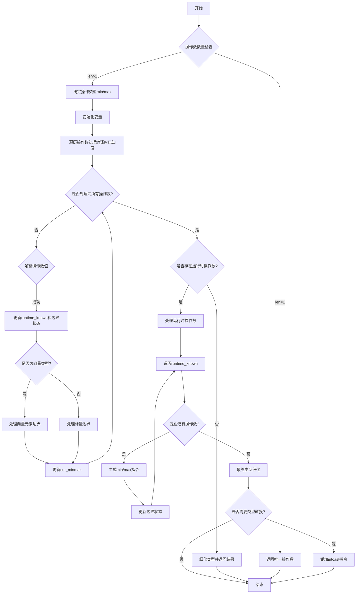

好的，我现在需要为这个Zig函数`analyzeMinMax`绘制流程图。首先，我要理解这个函数的功能和结构。这个函数似乎是用于分析最小值和最大值，可能是在编译时进行类型推断和优化。函数参数包括Sema（语义分析器）、Block（代码块）、源代码位置、操作标签（min或max）、操作数数组及其对应的源位置。

首先，我会通读代码，理清主要的逻辑分支和循环结构。函数开始时进行了一些断言，检查操作数数量是否匹配且大于0。如果只有一个操作数，直接返回该操作数。然后根据`air_tag`确定是min还是max操作。接着初始化一些变量，如`runtime_known`位集合、当前最小值/最大值引用、标量边界状态等。

接下来有一个循环遍历所有操作数，处理编译时已知的值，更新当前的min/max值。对于每个操作数，解析其值，处理向量类型，计算标量边界。如果遇到非整数类型，边界状态变为非整数。处理完所有编译时已知的操作数后，检查是否有运行时已知的操作数。

如果有运行时操作数，需要生成相应的指令，并继续处理这些运行时值，更新当前min/max和边界状态。最后，根据已知的边界细化结果类型，可能进行类型转换后返回最终结果。

绘制流程图时，我需要将这个过程分解为几个主要步骤：

1. 函数入口和初始检查。
2. 确定操作类型（min或max）。
3. 初始化变量。
4. 遍历操作数处理编译时已知值。
5. 处理运行时操作数。
6. 细化结果类型。
7. 返回结果。

每个步骤中需要包含条件判断和循环结构，特别是处理操作数的循环和运行时操作数的迭代。需要注意条件分支，例如操作数数量是否为1、边界状态的变化（unknown、defined、non_integral）、是否有运行时操作数存在等。

可能遇到的难点是如何正确表示循环和条件分支，尤其是嵌套的部分。例如，处理编译时已知值的循环内部有多个条件判断，处理运行时操作数的迭代也需要考虑不同的边界状态。此外，细化类型时的条件判断也需要准确表达。

我需要使用Mermaid的流程图语法，用矩形表示步骤，菱形表示条件判断，箭头表示流程方向。确保每个分支和循环都有清晰的路径，避免遗漏任何可能的执行路径。
================================================
