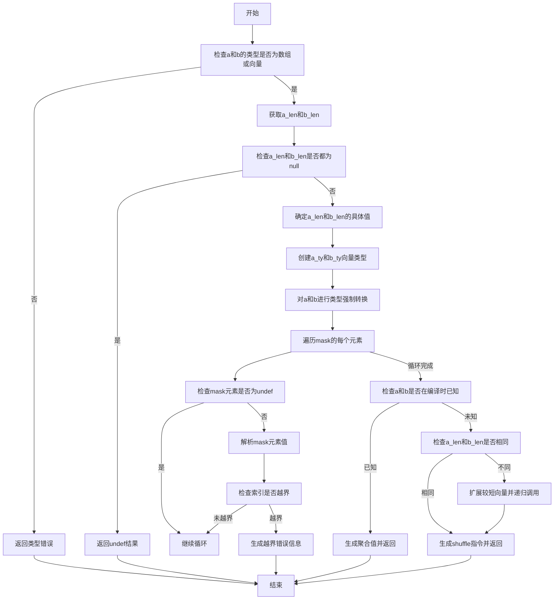

好的，我需要为给定的Zig函数`analyzeShuffle`绘制一个流程图。首先，我需要理解这个函数的结构和逻辑流程。让我先通读一遍代码，了解各个部分的作用。

函数`analyzeShuffle`的参数包括Sema、Block、源节点、元素类型、a和b参数、mask值及其长度。函数的主要目的是分析shuffle操作，处理可能的错误，并生成相应的Air指令。

首先，函数初始化一些变量，如`res_ty`作为结果向量类型。然后检查a和b参数的类型是否为数组或向量，并获取它们的长度。如果两者都为null，返回未定义的结果。否则，确定a_len和b_len，并创建对应的向量类型a_ty和b_ty。

接下来，处理可能的未定义情况，对a和b进行类型强制转换。然后遍历mask的每个元素，检查索引是否越界，如果有错误则生成相应的错误信息。

之后，尝试解析a和b的值，如果都能在编译时确定，则生成聚合值；否则处理运行时情况，确保a和b长度相同，必要时通过递归调用`analyzeShuffle`扩展较短的向量。

最后，生成并返回一个shuffle指令。

在绘制流程图时，需要将这些步骤分解为不同的判断和操作节点。需要注意条件分支，例如检查a和b的类型、处理mask元素的越界、解析值是否为编译时已知，以及处理a和b长度不同的情况。

可能存在的难点包括正确表示递归调用和处理多个条件分支之间的关系。需要确保每个判断节点都有明确的是/否分支，并且流程图的顺序符合代码的执行顺序。

此外，需要注意错误处理路径，例如当类型不符合预期时返回错误，或者mask索引越界时生成错误消息。这些错误路径应该在流程图中明确标出。

最后，生成流程图时要使用适当的符号，如开始/结束节点、处理步骤、判断节点、输入/输出等，确保图表清晰易懂。
================================================

流程图说明：
1. **类型检查**：首先验证a和b是否为向量/数组类型，否则报错
2. **长度处理**：处理a和b长度可能为null的情况，确定最终长度
3. **类型强制**：对未定义的参数填充undef值，并进行类型转换
4. **mask验证**：遍历mask所有元素，检查索引有效性并处理错误
5. **编译时优化**：如果参数值在编译时已知，直接构造结果
6. **运行时处理**：动态处理不同长度的向量，递归扩展至相同长度
7. **指令生成**：最终生成`shuffle`指令或返回预计算结果