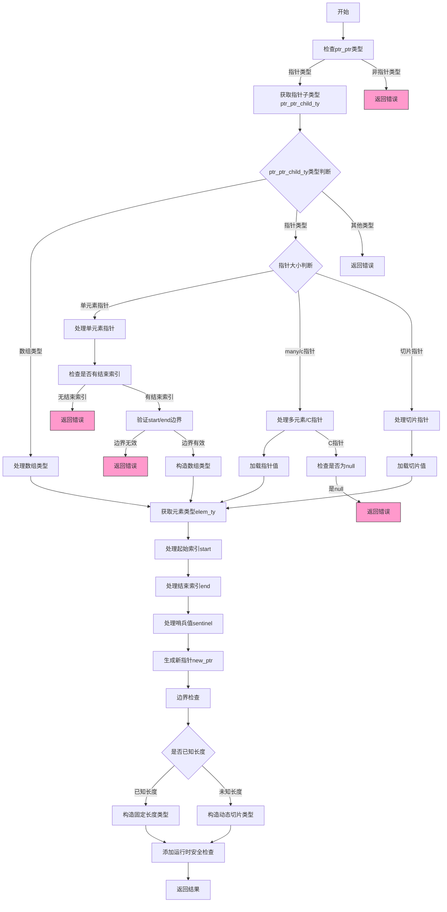

嗯，我需要画这个函数的流程图。首先，我得通读代码，理解它的结构和逻辑。这个函数叫做analyzeSlice，看起来是处理切片操作的，比如数组或指针的切片。函数有很多参数，包括sema、block、src、ptr_ptr等等。里面有很多条件判断和错误处理，可能涉及到类型检查、指针运算、边界检查等等。

首先，我应该理清函数的主要步骤。可能包括以下几个部分：
1. 检查ptr_ptr的类型，确保是指针类型。
2. 根据指针的子类型（数组、指针、切片等）进行不同的处理。
3. 处理起始和结束索引，进行类型转换和边界检查。
4. 处理哨兵值（sentinel）的情况。
5. 生成新的指针或切片，并进行安全性检查，比如越界检查、空指针检查等。
6. 返回结果。

接下来，我需要把这些步骤细化，看看每个条件分支如何处理。例如，当ptr_ptr_child_ty是数组时，如何处理；当是不同类型的指针时（如单元素指针、多元素指针、C指针、切片指针）等，分别有不同的逻辑。

然后，处理start和end的转换，包括是否通过长度（by_length）来生成结束索引，以及相关的算术运算。还有处理哨兵值的部分，可能需要检查内存中的值是否符合预期的哨兵。

之后，进行各种运行时安全检查，比如start是否小于等于end，索引是否越界，指针是否为null等。这些检查可能在编译时或运行时进行，根据是否处于comptime模式。

最后，构造返回的类型和值，可能根据是否已知长度来决定返回的是固定长度数组指针还是动态切片。

过程中需要注意错误处理，比如返回CompileError，并在条件不满足时调用sema.fail生成错误信息。

在画流程图的时候，需要把这些步骤和分支用不同的节点和条件判断表示出来。可能的结构是开始节点，然后依次是类型检查、处理指针类型、处理索引、处理哨兵、安全检查，最后返回结果。每个条件分支（比如switch case）需要有对应的判断框，然后分支到不同的处理流程。

可能还需要考虑递归处理某些情况，比如当指针是单元素指针时，可能需要进一步处理子类型是否为数组。此外，对于不同的指针大小（.one, .many, .c, .slice）有不同的处理逻辑。

总之，流程图需要涵盖函数的主要逻辑路径，包括所有重要的条件分支和处理步骤，以及错误处理路径。这可能需要多个判断节点和不同的处理块，最后汇总到返回结果。
================================================
