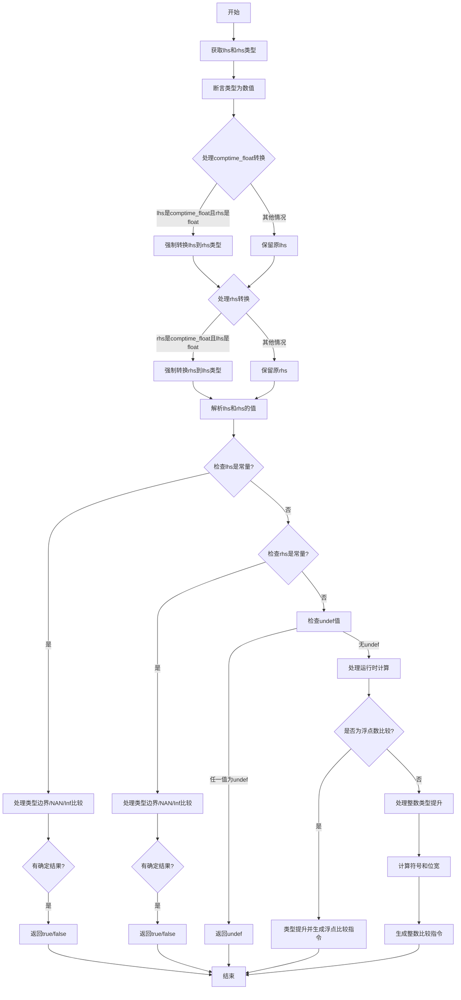

嗯，我需要用Mermaid来画出这个Zig函数的流程图。首先，我得先理解这个函数的结构和逻辑。函数名为cmpNumeric，看起来是用来比较两个数值类型的操作数，并返回比较结果的布尔值或者未定义。

首先，函数接收多个参数，包括sema、block、src、两个未转换的操作数uncasted_lhs和uncasted_rhs，操作符op，以及两个源位置lhs_src和rhs_src。函数返回一个Air.Inst.Ref或者编译错误。

接下来，函数开始部分获取了类型信息，并进行断言，确保两个操作数都是数值类型。然后处理了comptime_float和float之间的强制转换，根据不同的类型情况对lhs和rhs进行可能的类型转换。

之后，尝试解析lhs和rhs的值，检查是否有常量值的情况。如果有常量值，会进行一些优化判断，比如超出类型范围的比较结果、NaN的比较、无穷大和整数的比较等，直接返回布尔值或未定义。

如果两边的值都不是常量，或者需要运行时计算，函数会继续处理浮点数和整数类型的比较，包括类型提升、符号处理、位宽计算等，最后生成相应的中间指令。

在绘制流程图时，我需要将这些步骤分解成不同的决策节点和处理步骤。可能的步骤如下：

1. 开始
2. 获取类型信息并断言
3. 处理comptime_float和float的强制转换
4. 尝试解析lhs和rhs的值
5. 检查lhs是否是常量，进行可能的优化返回
6. 检查rhs是否是常量，进行可能的优化返回
7. 处理未定义的情况
8. 处理运行时计算需求
9. 处理浮点数比较的情况
10. 处理整数比较的情况，包括类型转换和位宽计算
11. 生成最终的比较指令
12. 结束

在流程图中，每个条件判断（如类型检查、是否为常量、是否有未定义值等）都需要用菱形节点表示，处理步骤用矩形节点，箭头表示流程方向。需要注意循环和条件分支的结构，确保逻辑正确。

可能需要注意的细节包括：处理NaN的特殊情况，无穷大与整数的比较，类型提升规则，以及在混合符号类型时的处理方式。此外，代码中的错误处理和返回路径也需要在流程图中体现，比如返回bool_true、bool_false、undefRef等不同情况。

最后，需要确保流程图的每个节点都对应代码中的关键步骤，并且逻辑顺序正确，没有遗漏重要的条件分支。
================================================
