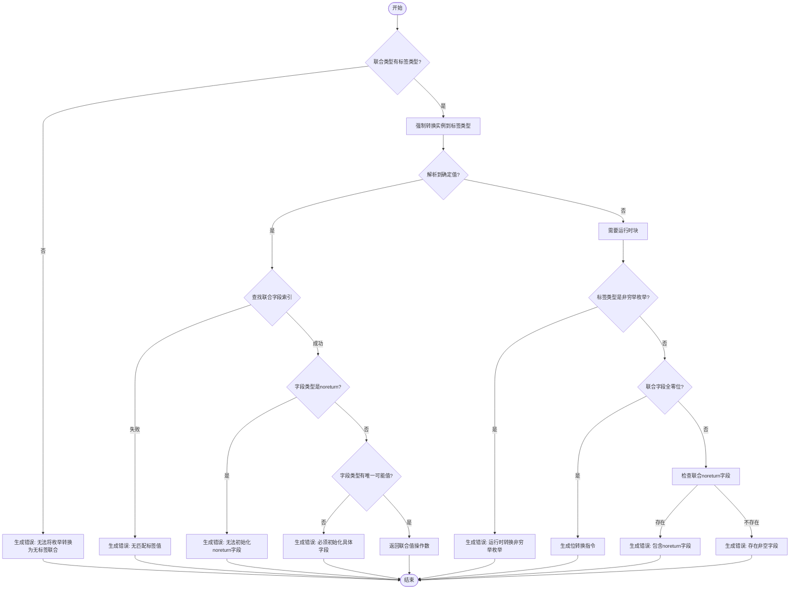

嗯，我需要为这个Zig函数`coerceEnumToUnion`画一个流程图。首先，我得仔细读一遍代码，理解它的逻辑结构。看起来这个函数的主要目的是将一个枚举类型强制转换为联合类型，期间会进行各种检查和处理错误的情况。

首先，函数接收几个参数，包括Sema、Block、目标联合类型union_ty，以及一些源代码位置信息。然后它获取类型信息，检查联合类型是否有标签类型。如果没有标签类型，就生成错误信息，指出不能将枚举转换为无标签的联合。这里可能需要一个判断框，判断`union_ty.unionTagType(zcu)`是否存在。

接下来，尝试将实例inst强制转换为标签类型tag_ty，如果成功得到值val，那么查找该值对应的联合字段索引field_index。如果找不到对应的字段，报错。然后检查字段类型是否是noreturn，如果是的话，报错。接着检查字段类型是否只有一个可能的值，如果不是，也需要报错。如果一切顺利，返回相应的Air指令。

如果无法在编译时解析值，需要运行时块。然后检查标签类型是否为非穷举枚举，如果是，报错。接着检查联合是否有noreturn字段，如果有，报错。之后，如果联合的所有字段都是零位类型，直接进行位转换。否则，报错指出存在非空字段。

流程图应该从函数入口开始，然后按照这些步骤分支处理不同的情况，包括错误处理和正常流程。需要确定各个条件判断的位置，以及每个条件成立后的处理步骤，包括生成错误信息或继续执行后续操作。

可能的结构是：

1. 检查union是否有tag类型，没有则报错。
2. 强制转换实例到tag类型。
3. 解析值，如果成功：
   a. 查找对应的字段索引，不存在则报错。
   b. 检查字段类型是否是noreturn，是则报错。
   c. 检查字段类型是否有唯一可能值，否则报错。
   d. 返回结果。
4. 如果无法解析值（需要运行时处理）：
   a. 检查是否为非穷举枚举，是则报错。
   b. 检查联合是否有noreturn字段，是则报错。
   c. 如果所有字段为零位，返回位转换。
   d. 否则，报错存在非空字段。

每个错误情况都需要生成相应的错误消息，并可能添加注释。整个流程中有多个条件分支，需要正确连接这些步骤，确保所有可能的路径都被覆盖。同时，注意错误处理的流程，比如错误消息的创建和销毁，以及如何传递错误。

可能还需要考虑一些细节，例如`try`操作符在Zig中如何处理错误，是否需要在流程图中表示错误返回的路径。此外，函数中多次使用`try`，意味着可能提前返回错误，需要在流程图中体现这些可能的出口。

最终，流程图应该清晰地展示函数的执行路径，包括所有条件判断、错误处理和正常流程的步骤。
================================================

流程图说明：
1. 入口先检查联合类型是否有标签类型，无则直接报错
2. 强制类型转换后分为编译时确定值和运行时处理两条路径
3. 编译时路径包含字段索引查找、noreturn检查、唯一值检查三层验证
4. 运行时路径处理非穷举枚举、零位字段优化、非空字段报错等情况
5. 所有错误路径最终汇聚到结束节点
6. 成功路径通过位转换或直接返回操作数结束