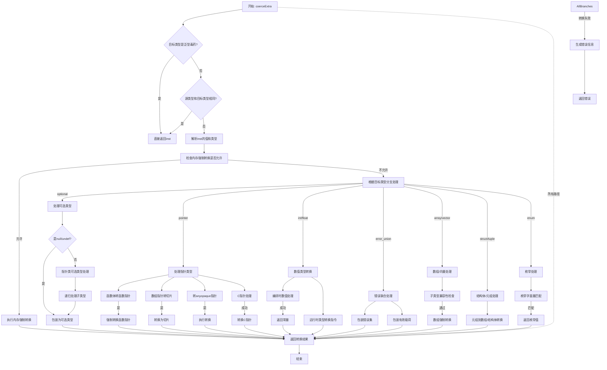

嗯，用户让我用Mermaid画出一个Zig函数`coerceExtra`的流程图。首先，我需要仔细阅读并理解这个函数的逻辑。看起来这个函数负责类型强制转换，处理各种类型之间的转换情况，比如指针、数组、枚举、错误联合体等等。函数的结构比较复杂，有很多条件判断和递归调用，比如处理可选类型、错误联合类型、指针的不同变体等等。

首先，我需要理清函数的主要流程。函数开始时会检查目标类型是否是泛型毒药类型，如果是就直接返回实例。然后比较源类型和目标类型是否相同，相同的话直接返回实例。接着处理内存中的强制转换，如果允许的话进行相应的位转换或者运行时检查。然后根据目标类型的不同标签（如optional、pointer、int、float等），分别处理不同的转换逻辑。

对于每个类型标签，函数可能有多个分支，例如处理optional类型时，需要检查实例值是否为null或undefined，然后递归处理子类型。处理指针类型时，要考虑指针的各种属性，如大小、是否是C指针、指向的类型等，可能还需要处理数组到切片的转换。

接下来，我需要将这些逻辑步骤转化为流程图。流程图应该从函数入口开始，按照条件判断分支，覆盖各个主要情况。由于函数非常复杂，可能需要分层处理，先画出主干流程，再细化每个分支的内部处理。

需要注意的是，函数中有很多递归调用，比如在处理optional类型时调用`coerceExtra`处理子类型，这时候流程图中可能需要表示递归的节点。此外，错误处理也是重要部分，当类型无法转换时，会生成错误信息并返回错误。

可能遇到的挑战是如何将复杂的条件分支和递归调用清晰地表达出来，同时保持流程图的可读性。可能需要使用子图或分组来组织不同的类型处理分支，或者使用注释节点来说明复杂逻辑。

最后，根据Mermaid的语法，将各个步骤和判断转化为节点和箭头，确保逻辑正确且结构清晰。可能需要多次调整布局，使流程图既全面又易于理解。
================================================

流程图说明：
1. 入口先进行基础检查（泛型毒药和类型相等性）
2. 内存强制转换作为快速路径优先处理
3. 通过switch结构处理不同目标类型：
   - Optional类型需要处理null/undef和递归转换
   - Pointer类型包含函数指针、切片转换、anyopaque等复杂逻辑
   - 数值类型区分编译时和运行时处理
   - 错误联合类型需要处理payload包装
   - 数组/向量需要子类型兼容性检查
   - 结构体/元组处理结构化转换
4. 所有失败路径最终汇聚到错误生成
5. 成功路径统一返回结果
6. 包含递归处理逻辑（如optional子类型转换）
7. 使用条件判断和子处理块组织复杂类型逻辑