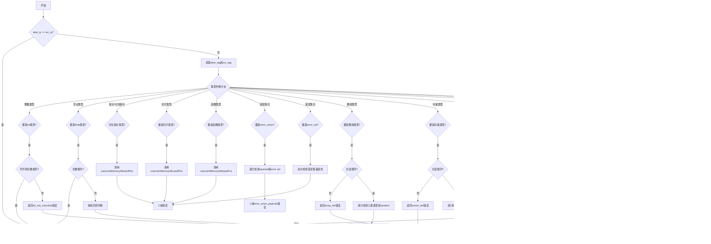

嗯，我现在需要为这个Zig函数`coerceInMemoryAllowed`画一个流程图。首先，我得仔细理解这个函数的结构和逻辑。这个函数的主要作用似乎是检查两种类型是否可以在内存中进行强制转换，并返回相应的结果。

首先，函数开始的时候会检查目标类型`dest_ty`和源类型`src_ty`是否相等。如果相等，就直接返回`.ok`。这部分比较简单，应该是流程图的第一个判断节点。

接下来，函数分别获取目标类型和源类型的类型标签`dest_tag`和`src_tag`。然后，根据不同的类型标签进行不同的处理。例如，如果两者都是整数类型，会进一步比较它们的符号和位数。如果符号相同且位数相同，返回`.ok`；否则根据不同的情况返回不同的错误结果。

然后处理浮点数类型，比较它们的位数是否相同。如果相同，返回`.ok`，否则可能返回错误。

接下来处理指针或类似指针的可选类型，调用另一个函数`coerceInMemoryAllowedPtrs`来处理指针的强制转换逻辑。

之后处理切片类型，同样调用`coerceInMemoryAllowedPtrs`。然后是函数类型，调用`coerceInMemoryAllowedFns`。错误联合类型、错误集合类型、数组、向量、数组与向量之间的转换、可选类型、元组等，每个都有相应的处理逻辑和条件判断。

最后，如果所有条件都不满足，返回`.no_match`。

现在，我需要把这些逻辑转化为流程图。每个条件判断对应一个菱形节点，不同的处理路径对应不同的分支。需要注意的是递归调用的情况，例如在处理错误联合类型或数组时，会递归调用`coerceInMemoryAllowed`函数。但流程图可能不需要展示递归的内部细节，只需表示当前层级的判断和处理。

可能的结构是：

1. 开始
2. 检查dest_ty和src_ty是否相等 → 是 → 返回.ok
3. 否 → 获取dest_tag和src_tag
4. 根据不同的类型组合进入不同的处理分支：
   - 整数类型
   - 浮点类型
   - 指针/可选指针
   - 切片
   - 函数
   - 错误联合
   - 错误集合
   - 数组
   - 向量
   - 数组与向量互转
   - 可选类型
   - 元组
5. 每个分支内部的条件判断和处理，最终返回相应的结果或错误
6. 如果所有分支都不匹配，返回.no_match

需要注意每个分支的结束点，可能需要合并到最终的结束节点。此外，递归调用可能需要以子流程的形式表示，或者在主流程中简化处理。

可能遇到的困难是如何清晰地表达所有条件分支而不显得混乱。使用Mermaid的子图（subgraph）可能有助于组织复杂的逻辑。不过，为了保持简洁，可能需要将每个主要类型分支作为一个独立的部分，并在主流程中顺序排列。

现在，我需要将这些步骤转化为Mermaid的流程图语法，确保每个判断和处理步骤正确对应，并合理连接。
================================================

注：实际流程中部分错误路径会直接终止，这里为简化表示将所有错误路径指向最终判断。递归调用（如error_union/array检查）在流程图中用"递归检查"示意，实际实现需要展开子判断树。