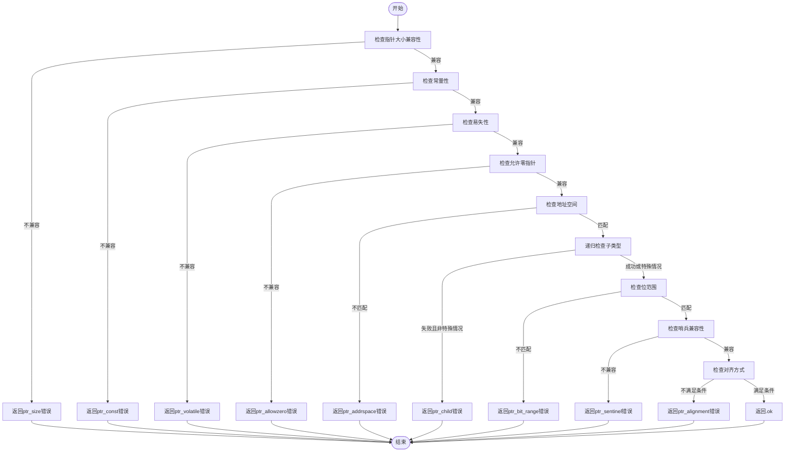

好的，我需要为给定的 Zig 函数 `coerceInMemoryAllowedPtrs` 绘制流程图。首先，我需要理解这个函数的结构和逻辑流程。

函数的主要目的是检查两种指针类型在内存中是否可以安全地进行强制转换。函数接受多个参数，包括源和目标指针类型，以及一些标志如 `dest_is_mut`。返回一个 `InMemoryCoercionResult` 类型的结果，指示是否允许转换或具体的错误原因。

首先，我会浏览代码并识别主要的条件判断和返回点：

1. **检查指针大小是否兼容**：比较 `src_info.flags.size` 和 `dest_info.flags.size`，如果不符合条件则返回 `ptr_size` 错误。
2. **检查常量性**：比较 `is_const` 标志，如果不符合条件则返回 `ptr_const` 错误。
3. **检查易失性**：比较 `is_volatile` 标志，如果不符合条件则返回 `ptr_volatile` 错误。
4. **检查允许零指针**：比较 `allowzero` 属性，如果不符合条件则返回 `ptr_allowzero` 错误。
5. **检查地址空间**：比较 `address_space`，如果不匹配则返回 `ptr_addrspace` 错误。
6. **递归检查子类型**：调用 `sema.coerceInMemoryAllowed` 检查指针指向的子类型是否兼容。如果失败且不是特殊情况，返回 `ptr_child` 错误。
7. **处理特殊情况**：允许数组指针在特定情况下忽略哨兵（sentinel）。
8. **检查位范围**：比较 `packed_offset` 的主机大小和位偏移，如果不匹配则返回 `ptr_bit_range` 错误。
9. **检查哨兵兼容性**：验证源和目标指针的哨兵是否兼容，否则返回 `ptr_sentinel` 错误。
10. **检查对齐方式**：比较源和目标的对齐要求，如果不符合则返回 `ptr_alignment` 错误。
11. **最终通过**：如果所有检查都通过，返回 `.ok`。

接下来，我需要将这些步骤转化为流程图。流程图应包含开始和结束节点，每个条件判断作为菱形节点，各个处理步骤作为矩形节点，错误返回作为终止节点，成功路径流向下一检查。

需要注意递归调用 `coerceInMemoryAllowed` 的处理，以及特殊情况的处理（如允许数组指针忽略哨兵）。此外，条件之间的逻辑关系需要正确表达，例如某些条件仅在之前的条件通过后才进行判断。

最后，确保所有可能的返回路径都被覆盖，并且流程图的逻辑与代码一致，没有遗漏任何错误返回点或条件分支。
================================================

流程图说明：
1. **层级检查**：从指针大小开始，逐层检查常量性、易失性、允许零指针、地址空间、子类型、位范围、哨兵和对齐。
2. **短路逻辑**：任一检查不通过立即返回对应错误。
3. **特殊处理**：子类型检查失败时，如果满足数组哨兵忽略条件，允许继续流程。
4. **最终结果**：所有检查通过后返回`.ok`。