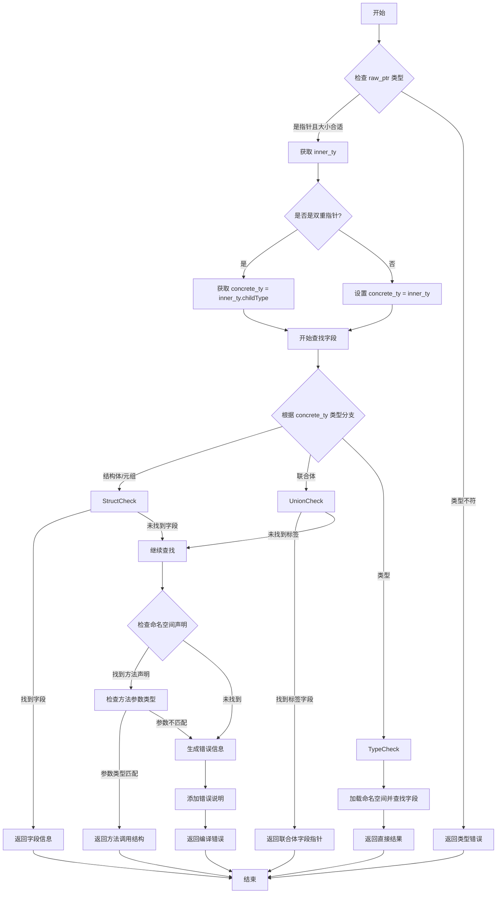

嗯，用户让我用Mermaid来画这个Zig函数的流程图。首先，我需要理解这个函数的功能和结构。函数名是fieldCallBind，看起来是用来处理结构体或联合体字段的调用绑定。函数参数包括Sema、Block、源位置、原始指针、字段名等。返回类型是ResolvedFieldCallee，可能包含解析后的字段或方法信息。

首先，我应该通读代码，理清主要步骤。函数开始时检查raw_ptr的类型，确定inner_ty。然后处理可能的双重指针（double pointer）情况，获取具体的concrete_ty和ptr_ty。接下来进入查找字段的部分，分为结构体、联合体、类型等不同情况处理。如果找不到字段，会检查命名空间中的声明，尝试解析方法。如果所有查找都失败，生成错误信息。

接下来，我需要将这些步骤转化为流程图。流程图通常包括开始、结束、判断节点、处理步骤和错误处理。需要考虑条件分支，比如类型是否为结构体、联合体等，以及是否找到字段或方法。错误处理部分需要生成错误消息，并可能添加额外说明。

可能遇到的难点是如何正确表示嵌套的条件判断，特别是find_field块中的各种情况。此外，处理双重指针和命名空间查找的部分也需要详细分解。需要注意Mermaid的语法，正确使用条件判断和子流程。

还需要注意代码中的break和return语句，这些会影响流程图的走向。例如，在结构体处理中，如果找到字段，直接返回结果；否则继续查找。联合体和类型处理也有类似的情况。最后的错误处理部分需要汇总所有可能的错误原因，并生成相应的错误消息。

总结步骤：
1. 开始函数。
2. 解析raw_ptr的类型，检查是否为指针，确定inner_ty。
3. 检查是否为双重指针，调整concrete_ty和ptr_ty。
4. 进入查找字段的流程：
   a. 如果是结构体，尝试根据字段名查找索引。
   b. 如果是元组（tuple），处理len或数字索引。
   c. 如果是联合体，查找标签字段。
   d. 如果是类型，加载命名空间并查找字段。
5. 如果字段未找到，检查命名空间中的声明，尝试解析方法。
6. 方法参数类型检查，确定是否匹配。
7. 如果所有查找失败，生成错误消息，包含可能的提示。
8. 返回结果或错误。

在绘制流程图时，每个判断点（如类型检查、是否找到字段）都需要一个菱形节点，处理步骤用矩形节点，错误处理用不同的路径。可能需要使用子图来组织复杂的部分，比如查找字段的不同情况。

最后，需要验证流程是否覆盖了所有代码路径，特别是错误情况和边界条件，比如双重指针处理、方法参数类型不匹配等。
================================================
