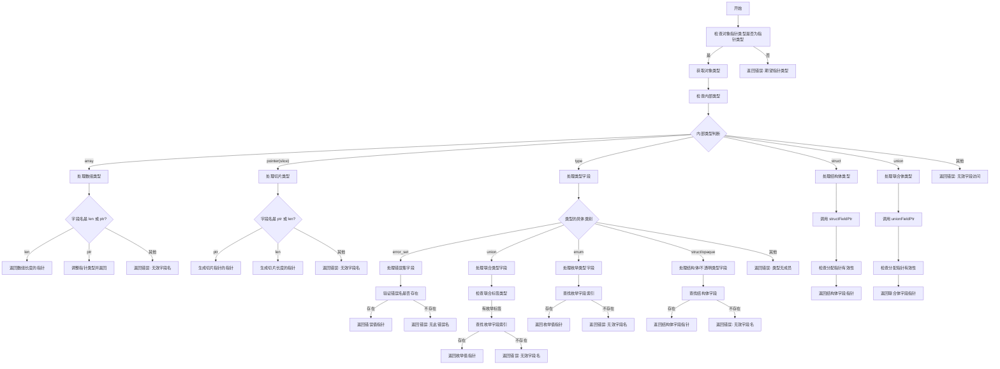

嗯，我现在需要为一个用Zig写的函数`fieldPtr`画一个流程图。首先，我得仔细看看这个函数的结构和逻辑。函数的主要作用似乎是处理结构体或联合体等类型的字段指针访问，可能涉及到错误检查、类型推断和指针操作。

首先，我会通读整个函数，理解每个步骤的大致流程。函数开始部分检查对象指针的类型，如果不是指针类型，就返回错误。然后根据指针的类型，处理数组、切片、结构体、联合体等不同的情况。每个分支处理不同的字段访问，比如数组的`len`或`ptr`，切片的`ptr`和`len`，类型中的错误集、枚举、结构体、联合体等。

接下来，我需要将每个判断和分支转化为流程图的节点和条件。例如，函数首先检查`object_ptr_ty`是否为指针类型，如果不是则报错。如果是，再检查其子类型是否是数组、指针（可能是切片）、类型、结构体、联合体等。每个类型对应的处理逻辑不同，比如数组处理`len`和`ptr`，切片处理`ptr`和`len`，类型处理错误集、枚举等。

需要注意的是，函数中有很多条件判断，比如`switch`语句和`if`条件，这些都需要在流程图中用菱形判断节点表示。每个处理分支可能需要进一步细化，比如处理数组时，如果字段是`len`则返回数组长度的指针，如果是`ptr`则调整指针类型并返回。

此外，函数中有递归调用其他方法的情况，比如调用`structFieldPtr`和`unionFieldPtr`，这些在流程图中可能需要表示为子流程或直接作为步骤节点。

可能存在的一些挑战包括：

1. **复杂的条件分支**：函数中有多个嵌套的`switch`和`if`语句，需要准确映射每个条件判断的路径。
2. **递归或子函数调用**：如何处理这些调用在流程图中的表示，是否需要展开或简化为一个步骤。
3. **错误处理**：函数中多处可能返回错误，需要将这些错误路径在流程图中明确标出。

为了简化，可能将每个主要的条件分支作为独立的判断节点，然后根据不同的情况连接到对应的处理步骤。例如：

- 开始
- 检查对象类型是否为指针 → 是 → 获取子类型
- 子类型是数组 → 检查字段名是否是`len`或`ptr` → 处理相应字段
- 子类型是指针（切片）→ 处理`ptr`和`len`字段
- 子类型是类型 → 处理错误集、枚举、结构体等
- 子类型是结构体 → 调用`structFieldPtr`
- 子类型是联合体 → 调用`unionFieldPtr`
- 其他类型 → 返回错误

在每个处理步骤中，可能需要进一步细化，比如处理数组的`len`时，生成对应的长度值并返回指针。对于切片的`ptr`字段，调整指针类型并返回。对于结构体和联合体，调用相应的字段指针处理方法，并检查指针的有效性。

需要确保流程图覆盖所有可能的路径，包括错误路径。例如，当字段名不存在于结构体或联合体中时，返回错误。同时，处理不同类型时的不同返回逻辑也需要准确表示。

最后，将所有这些步骤和判断用mermaid的流程图语法表示出来，确保节点和箭头的正确连接，每个条件分支都有明确的路径，最终结束于返回结果或错误。
================================================
