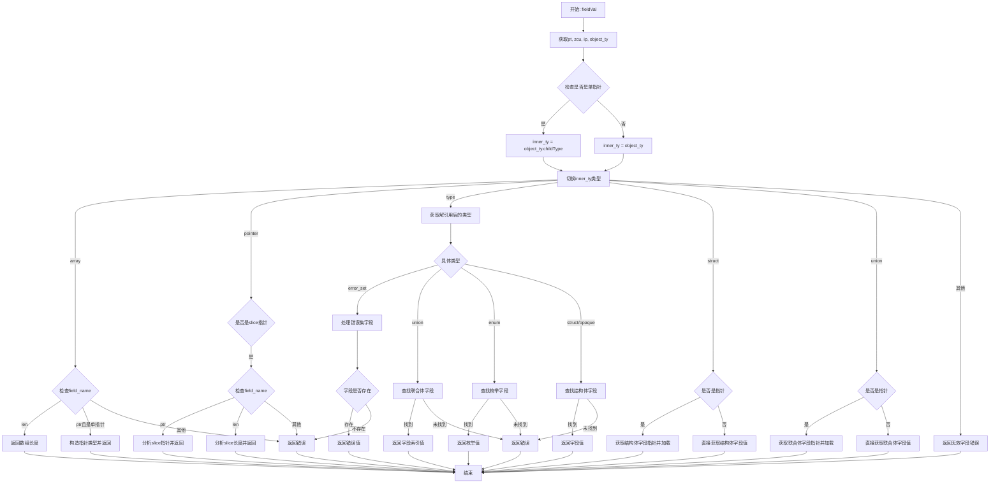

嗯，我需要帮用户用Mermaid画出Sema.zig中fieldVal函数的流程图。首先，我应该仔细阅读这个函数的代码，理解它的逻辑结构和各个分支。

函数开始部分，首先获取pt、zcu、ip等变量，然后确定object的类型object_ty。接着检查是否是单指针，如果是的话inner_ty就是指针指向的类型，否则就是object_ty本身。然后根据inner_ty的类型进入不同的分支处理。

第一个大的分支是数组类型（.array），处理len和ptr字段。然后是指针类型（.pointer），如果是slice，处理ptr和len字段。接下来是类型为type的情况，处理错误集、联合体、枚举、结构体等。然后是结构体（.struct）和联合体（.union）类型，根据是否是指针决定加载方式。其他情况则跳转到最后的失败处理。

我需要将每个条件判断和对应的处理步骤转化为流程图节点。比如，判断inner_ty的类型，不同的类型对应不同的处理分支。每个分支内部还有可能嵌套更多的条件判断，比如在.type分支下处理不同的子类型（error_set、union、enum等）。

需要注意的是，有些步骤可能会递归调用其他函数，比如sema.analyzeLoad、sema.structFieldVal等，但流程图主要关注当前函数的逻辑，不需要深入这些函数的内部细节。另外，错误处理部分（如sema.fail）也需要作为流程图的终止节点。

可能会遇到的困难是如何将复杂的嵌套条件判断用Mermaid的结构清晰表示出来，避免过于混乱。可能需要将部分分支拆分成子流程，或者合理使用条件判断和合并点。

现在，我应该按照代码的执行顺序，逐步分解每个判断和处理步骤，用Mermaid的语法绘制出流程图的结构。确保每个条件分支都有对应的节点，处理步骤正确连接，最后汇总到结束或错误处理节点。
================================================
