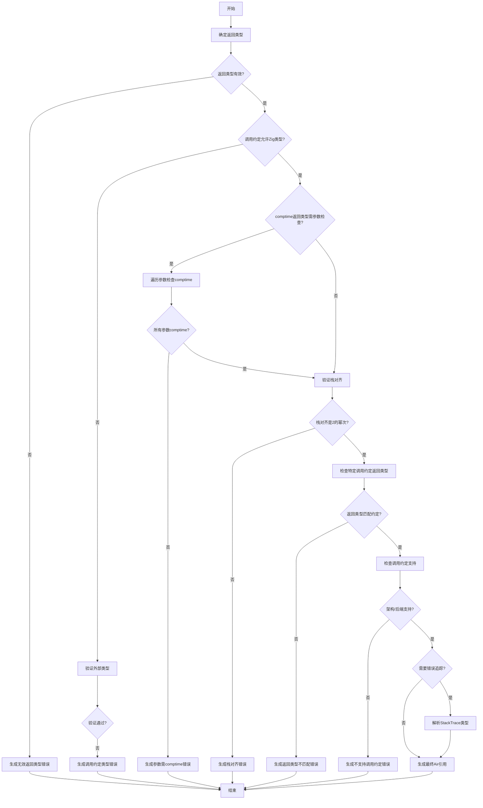

好的，我需要为给定的Zig函数`finishFunc`绘制一个流程图。首先，我需要理解这个函数的结构和逻辑流程。让我先通读一遍代码，看看每个部分的作用。

函数`finishFunc`似乎负责完成函数的语义分析，处理返回类型、调用约定、参数检查等。它接受多个参数，包括Sema结构体指针、块指针、函数索引、函数类型等，并返回一个Air指令引用或编译错误。

接下来，我需要将代码分解成主要的步骤：

1. **确定返回类型**：根据`opt_func_index`是否存在以及`ret_poison`的值，选择`bare_return_type`或从`ip`中获取返回类型。
2. **验证返回类型是否有效**：检查返回类型是否是允许的有效类型，否则报错。
3. **检查调用约定是否允许Zig类型**：如果不是，验证返回类型是否符合外部类型要求。
4. **处理comptime-only返回类型的情况**：如果返回类型需要comptime，但参数不全是comptime，生成错误信息。
5. **验证调用约定的栈对齐**：确保传入的栈对齐是2的幂次。
6. **根据特定调用约定检查返回类型**：如中断处理函数必须返回void或noreturn。
7. **检查调用约定是否被目标架构和编译器后端支持**：如果不支持，生成相应的错误。
8. **处理错误返回追踪**：如果需要错误追踪，确保StackTrace类型已解析。
9. **返回结果**：根据`opt_func_index`是否存在，返回对应的Air引用。

现在，我需要将这些步骤转化为流程图中的节点，并确定它们之间的逻辑分支和条件判断。例如，步骤2和步骤3可能包含条件判断，导致不同的错误路径。步骤4中的循环检查参数是否为comptime，如果发现非comptime参数，则生成错误信息。步骤5和步骤6涉及不同的调用约定检查，可能需要多个分支。

需要注意的是，有些步骤可能并行执行，而有些是顺序的。例如，确定返回类型必须在验证返回类型之前。错误处理部分可能需要多个错误节点，每个错误条件生成不同的错误消息。

在绘制流程图时，应使用不同的形状表示不同的元素，如矩形表示处理步骤，菱形表示条件判断，椭圆形表示开始和结束，平行四边形表示输入/输出。同时，错误路径应明确标出，并指向相应的错误处理步骤。

最后，确保流程图的逻辑清晰，能够准确反映代码的执行流程，特别是条件分支和错误处理部分。需要检查是否有遗漏的条件或步骤，并确保所有可能的执行路径都被覆盖。
================================================
