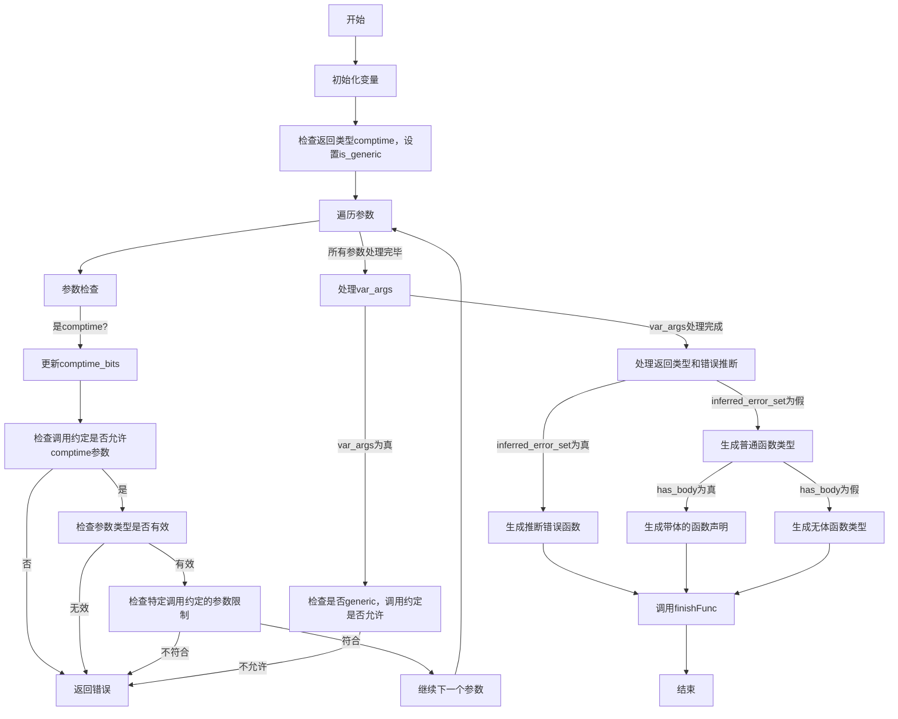
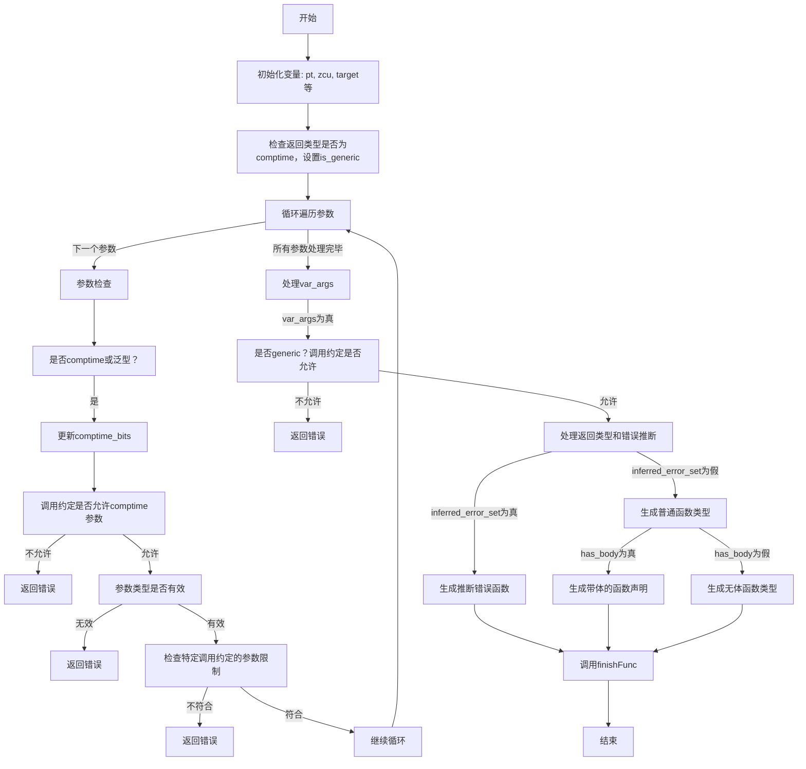
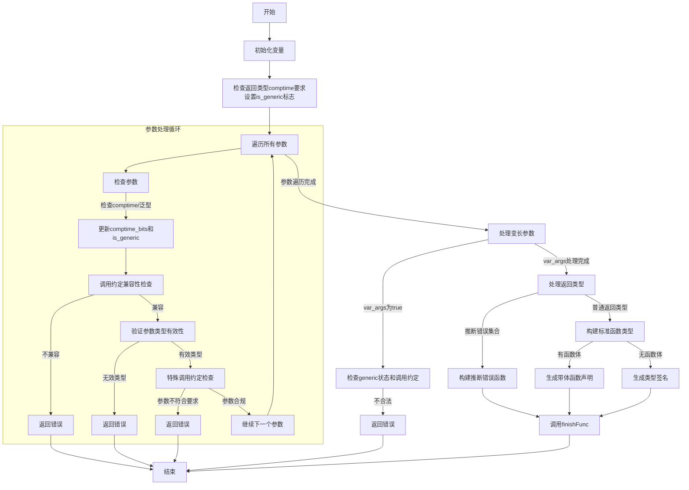

好的，我现在需要根据用户提供的Zig代码中的`funcCommon`函数，用Mermaid语法画出流程图。首先，我需要仔细阅读并理解这段代码的功能和结构。

首先，这个函数`funcCommon`的参数非常多，看起来像是处理函数声明或定义的语义分析的函数。函数内部有很多参数检查，包括调用约定（calling convention）、参数类型、返回类型等。代码中涉及很多错误处理，比如使用`sema.fail`返回编译错误。此外，还涉及到不同类型的处理，比如泛型参数、comptime参数、varargs等。

接下来，我需要理清函数的主要流程。大致步骤如下：

1. **初始化变量和参数检查**：函数开始处获取一些上下文信息，比如`pt`, `zcu`, `gpa`, `target`, `ip`等。然后处理返回类型的comptime要求，设置`is_generic`标志。

2. **遍历参数**：通过循环遍历所有参数，检查每个参数的类型是否符合调用约定和其他约束。包括检查参数是否为comptime、是否为泛型、参数类型是否有效、是否符合特定调用约定（如中断处理函数的参数限制）等。如果发现不符合条件的情况，返回相应的错误。

3. **处理变长参数（var_args）**：检查变长参数是否在允许的调用约定下使用，以及是否在泛型函数中使用变长参数。

4. **处理返回类型和错误推断**：根据是否推断错误集合（`inferred_error_set`），生成相应的函数类型或错误推断的函数声明。如果函数有主体（`has_body`），则进一步处理函数体。

5. **生成函数类型并返回结果**：根据不同的情况（是否有主体、是否推断错误集合），生成对应的函数类型或声明，最后调用`finishFunc`完成处理。

接下来，我需要将这些步骤转化为流程图。流程图通常包括开始、结束、判断节点、处理步骤和错误处理。需要注意循环结构如何处理，比如遍历参数的循环。

可能的流程节点：

- 开始
- 初始化变量（pt, zcu, target等）
- 检查返回类型是否是comptime，设置is_generic
- 循环遍历每个参数：
  - 检查参数是否为comptime，更新comptime_bits
  - 检查参数类型是否允许在当前调用约定下
  - 检查参数类型是否有效（如非opaque类型等）
  - 检查特定调用约定的参数限制（如中断函数的参数数量和类型）
- 结束循环
- 处理var_args的情况
- 检查是否推断错误集合（inferred_error_set）
  - 如果是，处理错误推断逻辑
  - 否则，生成普通函数类型
- 根据是否有函数体（has_body）生成不同的函数声明或定义
- 调用finishFunc并返回结果

需要注意的是，循环中的每个参数检查都可能触发错误返回，所以每个检查步骤都需要判断是否出错，并可能提前退出流程。此外，错误处理部分在流程图中可能表现为多个错误出口。

不过，由于Mermaid流程图主要展示主要流程，可能不需要每个错误检查都单独画出，而是概括为判断节点，如“参数是否有效？”如果否，则进入错误处理。

但考虑到代码中有多个不同的错误条件，可能需要多个判断分支。例如：

对于每个参数：
- 是否comptime且调用约定不允许？→ 错误
- 参数类型是否无效？→ 错误
- 是否符合特定调用约定的参数要求？→ 错误

这些都需要在流程图中体现。

但过于详细的流程图可能变得复杂，所以需要平衡详细程度和可读性。

另外，代码中的条件分支，如`if (var_args)`、`if (inferred_error_set)`、`if (has_body)`等，都需要在流程图中作为判断节点。

可能的Mermaid流程图结构：

这只是一个初步的结构，可能需要调整。例如，循环遍历参数的部分需要正确表示循环结构。在Mermaid中，循环可以用子流程或者循环节点表示，但可能不够直观。可能需要用条件判断来表示循环是否继续。

另外，错误处理的节点可能需要指向同一个错误出口，但Mermaid中每个错误条件可能都需要单独的节点，这样会导致流程图变得复杂。可能需要简化，将错误处理统一表示。

经过调整，最终的流程图可能如下：

这样的流程图覆盖了主要的判断和处理步骤，但可能忽略了一些细节，比如不同的错误消息或具体的参数索引检查。不过，作为高层次流程图，这已经足够展示函数的主要逻辑。

需要注意，代码中的循环遍历参数部分，在流程图中需要用循环结构表示。这里用“循环遍历参数”和“下一个参数”节点来表示循环。

此外，错误处理节点（Error1, Error2等）可能应该合并为一个错误处理节点，指向返回错误，但为了清晰，暂时分开表示。不过，在Mermaid中，可以统一指向同一个错误处理节点。

最终，调整后的流程图可能如下：
================================================

该流程图特点：
1. 使用子图清晰展示参数处理的循环结构
2. 用菱形节点表示关键条件判断
3. 错误处理路径统一指向结束节点
4. 区分了推断错误集合和普通返回类型两条主路径
5. 保留了核心校验逻辑（调用约定检查/类型校验/特殊调用约定参数校验）
6. 展示了变长参数处理的独立分支
7. 最终通过finishFunc统一收束处理流程