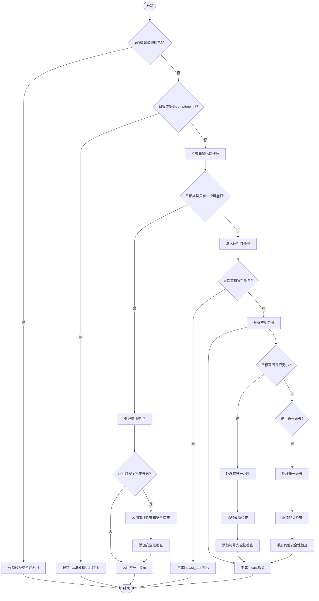

嗯，我现在需要帮用户用Mermaid画出他们提供的Zig函数intCast的流程图。首先，我得先理解这个函数的结构和逻辑流程。让我先仔细读一下代码。

函数intCast的参数挺多的，包括sema、block、src、dest_ty等等。看起来这是处理整数类型转换的函数，可能涉及到编译时的检查和安全性的处理。函数内部有很多条件判断，比如检查是否是编译时已知的值，目标类型是否是comptime_int，是否需要运行时安全检查等等。

首先，函数的开始部分，获取了pt和zcu，然后检查目标类型和操作数类型的标量类型。接着，如果操作数是编译时已知的，就直接进行类型强制转换。否则，如果目标类型是comptime_int，就返回错误，因为不能将运行时值转换为comptime_int。

接下来，检查向量化的操作数，判断是否是向量类型。然后处理目标类型只有一个可能值的情况，比如u0类型，这时候需要检查操作数是否为0，并在需要时添加运行时安全检查。

之后，进入主要的运行时处理部分。如果开启了运行时安全检查和需要安全措施，这里会有很多分支。例如，检查目标类型是否比源类型更窄，是否需要处理符号位，添加相应的比较和安全性检查。这包括处理有符号转无符号的情况，确保值非负，或者处理截断的情况，确保值在目标类型的范围内。

最后，根据不同的情况生成相应的指令，比如intcast_safe或者普通的intcast。

现在我需要把这些逻辑步骤转化为流程图。流程图应该从函数入口开始，按条件分支展开各个可能的路径。每个条件判断对应一个菱形节点，处理步骤用矩形节点，结束节点用椭圆。

可能的流程步骤：

1. 检查操作数是否是编译时已知，如果是，直接返回coerce后的结果。
2. 否则，检查目标类型是否是comptime_int，如果是，报错。
3. 检查向量化操作数，确定是否为向量类型。
4. 检查目标类型是否只有一个可能值（如u0），如果是，进行零值检查并添加安全措施。
5. 否则，进入运行时处理，检查是否需要安全措施。
6. 在安全措施中，处理类型范围缩小的情况，添加比较和截断检查。
7. 处理有符号转无符号时的非负检查。
8. 最后生成相应的intcast指令。

需要将这些步骤和条件分支用Mermaid的流程图语法表示出来。需要注意条件的分支走向，比如每个if-else结构对应的路径，以及可能的嵌套条件。

需要注意的是，代码中有多个嵌套的if和else块，还有一些循环结构比如处理向量时的操作。但流程图需要简化这些结构，避免过于复杂。可能需要将一些步骤合并，或者拆分为子流程。

比如，处理目标类型只有一个可能值的部分，可以作为一个分支；处理运行时安全的部分可以分为几个子条件：是否支持安全指令，范围缩小，符号转换等。

可能遇到的挑战是代码中的嵌套条件较多，需要合理组织流程图的层级，保持清晰。同时，确保所有重要的条件分支都被覆盖，比如wanted_value_bits < actual_value_bits的情况，以及不同符号类型的处理。

现在，我需要将这些逻辑转化为Mermaid的语法。开始绘制流程图，从函数入口开始，逐步添加判断和处理步骤。
================================================

流程图说明：
1. 函数入口首先检查操作数是否为编译时已知值，如果是则直接强制转换类型。
2. 否则检查目标类型是否为`comptime_int`，若是则直接报错。
3. 接着检查向量化操作数并判断目标类型是否为单值类型（如u0），若是则进行零值验证。
4. 对于非单值类型，进入运行时处理流程，根据后端支持情况选择直接生成安全指令或手动添加范围检查。
5. 范围检查包括类型截断检查和符号丢失检查，均会添加对应的安全性验证。
6. 最终根据检查结果生成对应的`intcast`或`intcast_safe`指令并结束流程。