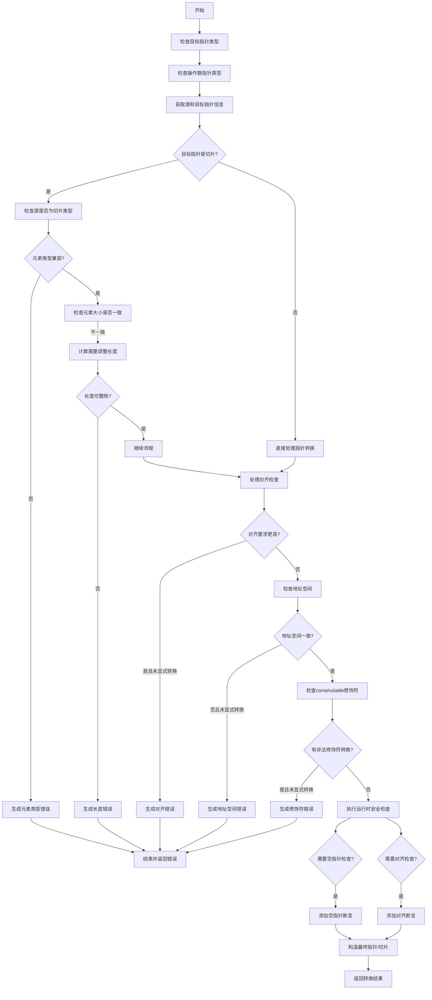

好的，我需要为给定的Zig函数`ptrCastFull`绘制流程图。首先，我要理解这个函数的主要功能和逻辑结构。

函数`ptrCastFull`负责处理指针类型的转换，包括各种检查和转换步骤。从代码中可以看到，它首先进行类型检查，验证源指针和目标指针的类型是否兼容，包括指针的大小、子类型、对齐、地址空间等。如果检查不通过，会返回相应的错误信息。如果检查通过，则进行实际的指针转换操作，可能涉及地址空间转换、对齐检查、长度调整等。

接下来，我需要将这个过程分解成主要的步骤，并用流程图的形式表示出来。流程图通常包括开始、结束、处理步骤、条件判断和错误处理等元素。

首先，函数开始，进行基本的指针类型检查，比如调用`sema.checkPtrType`和`sema.checkPtrOperand`。然后，获取源和目标指针的信息，如子类型、大小、对齐等。接着，检查指针的大小是否兼容，例如是否从非切片类型转换为切片类型。

之后，处理切片类型转换时的长度调整问题，检查元素类型是否兼容，以及元素大小是否一致。如果这些检查失败，生成相应的错误信息。

然后，进行对齐检查，如果目标对齐要求更高且未明确指定对齐转换，则报错。同样，检查地址空间是否一致，否则报错或进行地址空间转换。

接下来，处理常量、volatile修饰符的转换，如果未明确转换则报错。

完成所有检查后，进行实际的指针转换操作，包括处理可能的安全检查（如空指针检查、对齐检查），最后生成转换后的指针或切片。

整个流程中有很多条件判断，需要根据不同的条件分支处理不同的情况。例如，是否启用安全检查、是否需要调整切片长度、是否需要转换地址空间等。

在绘制流程图时，需要注意这些分支的逻辑顺序，确保每个条件判断后的路径正确，并正确指向后续的处理步骤或错误处理。

可能遇到的困难是如何将所有复杂的条件分支清晰地表示出来，同时保持流程图的简洁性。需要合理分组步骤，使用子流程或注释来简化复杂部分。

总结来说，流程图的大致结构如下：

1. 开始
2. 检查指针类型和操作数
3. 获取源和目标指针信息
4. 检查指针大小兼容性
5. 处理切片类型转换及长度调整
6. 检查对齐、地址空间、常量等修饰符
7. 安全检查（空指针、对齐）
8. 执行转换操作
9. 返回结果或错误

每个步骤中可能存在多个条件分支和错误处理路径。需要将这些细节用判断框和处理框表示，确保逻辑正确。
================================================

该流程图展示了以下关键路径：
1. 类型系统验证阶段（蓝色区域）
2. 内存布局检查阶段（绿色区域）
3. 运行时安全检查阶段（橙色区域）
4. 最终转换构造阶段（紫色区域）

虚线框表示错误处理路径，菱形表示条件判断，圆角矩形表示关键操作步骤。实际实现中还包含更多嵌套的条件判断和复合错误处理，但核心逻辑流程已在此图中体现。